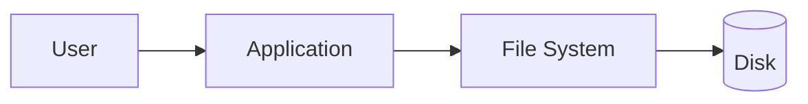
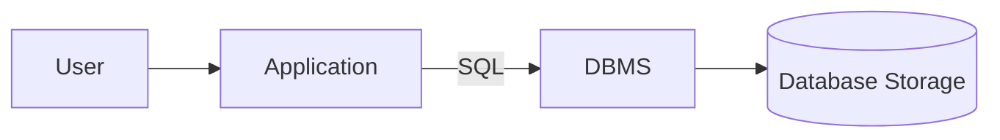
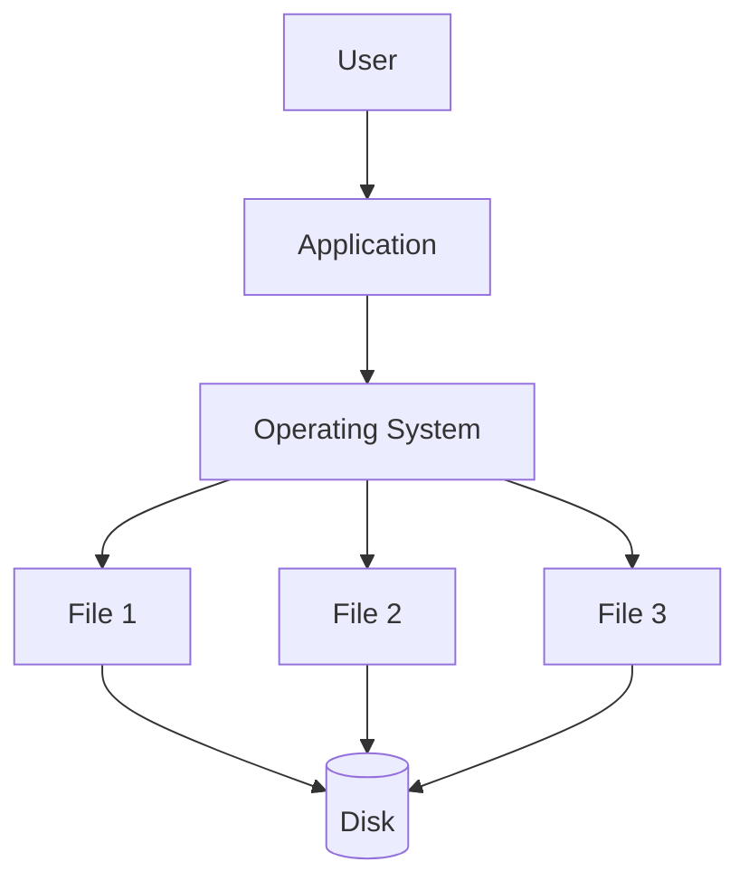
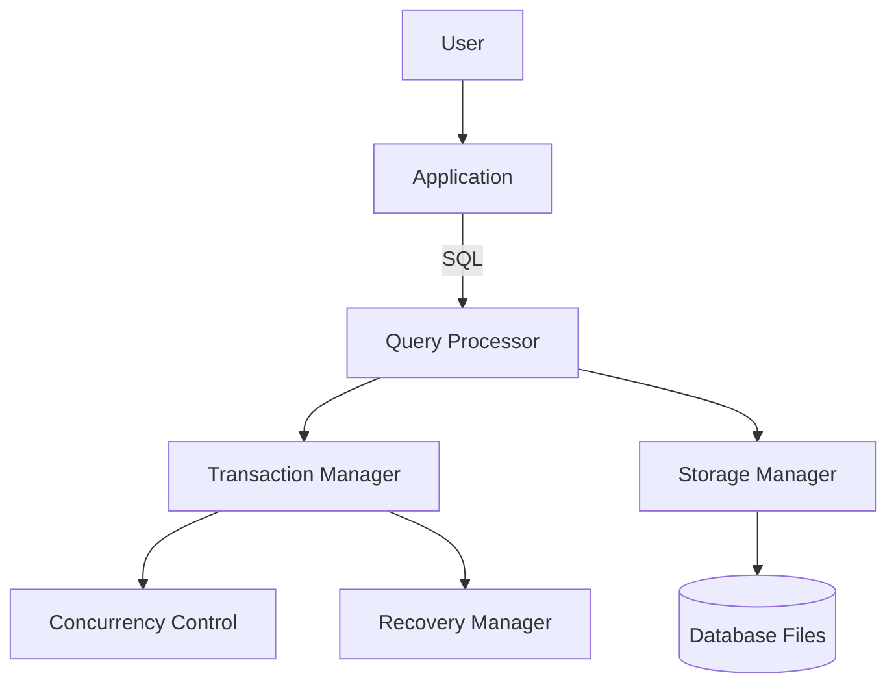

> [!important] A **file system** stores data as independent files managed by the operating system, with no built-in concept of relationships, constraints, or transactions. A **DBMS** stores data as a structured, centrally-managed collection with enforced integrity, concurrency control, and query capability. Organizations moved from file-based storage to DBMSs because file systems don't scale — technically or organizationally — past a certain level of complexity.

---

# Introduction

In the earliest days of computing, applications stored their data directly in files: sequential files, indexed files (ISAM), or simple binary blobs, all managed via the operating system's file APIs (`open`, `read`, `write`, `close`).

This worked fine when:

- One application owned one dataset
- Data volumes were small
- Only one user accessed data at a time
- Queries were simple ("read record 42")

As software systems grew — payroll systems, banking, airline reservations — problems multiplied. Different departments needed their own files for the same real-world entities (a "customer" existed in both the billing file and the shipping file). Keeping these copies in sync manually was error-prone. Concurrent access from multiple terminals caused corruption. There was no way to ask complex questions ("show me all customers who spent more than $1,000 last quarter") without writing new custom programs each time.

By the 1970s, the relational model (Codd, 1970) and the first DBMSs emerged specifically to solve these problems — providing a single, centrally managed, query-able source of truth.

> [!tip] Interview Framing Interviewers love this history because it reveals _why_ each DBMS feature exists. Every DBMS feature (constraints, transactions, indexes, the query language) is a direct response to a specific file-system failure mode.

---

# Real-world Scenario

**Example: A University Student Management System**

### 1. File System Approach

- `students.txt` — student ID, name, address
- `courses.txt` — course ID, name, credits
- `enrollments.txt` — student ID, course ID, grade

Each application (registrar's office tool, grading tool, fee-payment tool) reads and writes these files directly.

**Problems:**

- If a student's address is also duplicated in `fees.txt`, updating one doesn't update the other → inconsistency.
- Two staff members editing `enrollments.txt` simultaneously can corrupt or overwrite each other's changes.
- Finding "all students enrolled in more than 3 courses with a GPA above 3.5" requires writing a custom program that scans and joins these files manually.
- If the system crashes mid-write, `enrollments.txt` might be left in a partially-written, corrupted state.

### 2. DBMS Approach

- Tables: `students`, `courses`, `enrollments` with foreign key constraints linking them.
- A single `UPDATE students SET address = ... WHERE id = ...` updates the one authoritative copy.
- Transactions ensure enrollment + fee-charging happen atomically.
- A single SQL query answers the GPA question directly, using indexes for speed.
- Concurrent access is safely managed by the DBMS's concurrency control.

**Result:** Same functionality, dramatically less custom code, far fewer bugs, and built-in guarantees the file system approach could never offer.

---

# What is a File System?

> [!important] Definition A file system is the component of an operating system responsible for organizing, naming, storing, and retrieving files on physical storage — with no inherent understanding of the _structure_ or _relationships_ within the data it stores.

- Files are typically unstructured or semi-structured (CSV, JSON, plain text, binary)
- Applications are responsible for parsing file contents themselves
- The OS provides only basic operations: create, read, write, delete, rename, set permissions
- No built-in query language, no relationships between files, no automatic consistency enforcement

The application bears full responsibility for parsing, validating, locking, and searching data.

---

# What is a DBMS?

> [!important] Definition A DBMS is software that manages structured data centrally, providing a query language, enforced schema and constraints, transactional guarantees, concurrency control, and recovery mechanisms — abstracting the physical storage details away from applications.

The DBMS sits as a mediator: applications never touch storage directly — they issue queries, and the DBMS handles parsing, optimization, locking, and physical I/O.

See [[What is DBMS]] for a full breakdown of DBMS internals.

---

# Architecture Comparison

## File System Architecture

## DBMS Architecture

The key architectural difference: a file system has **no intermediary logic layer** between the application and storage. A DBMS interposes an entire stack — query processing, transaction management, concurrency control, and recovery — before any byte is written or read.

---

# Detailed Comparison: DBMS vs File System

|Feature|File System|DBMS|
|---|---|---|
|Data organization|Unstructured/loosely structured files|Structured tables with defined schema|
|Data redundancy|High — same data often duplicated across files|Minimized via normalization|
|Data consistency|Not guaranteed; manual sync required|Enforced via constraints and transactions|
|Data sharing|Difficult; file-level locking is coarse|Designed for concurrent, fine-grained sharing|
|Data security|OS-level file permissions only|Fine-grained, role-based, column/row-level security|
|Data integrity|No built-in validation|Constraints (PK, FK, CHECK, NOT NULL)|
|Concurrency control|Minimal or none (risk of corruption)|Locking / MVCC ensures safe concurrent access|
|Transactions|Not supported natively|Full ACID transaction support|
|Backup|Manual file copying|Built-in backup/restore tooling|
|Recovery|Manual, error-prone|Write-ahead logging enables automatic recovery|
|Query capability|Custom code required for every query|Declarative SQL for arbitrary queries|
|Indexing|Not available by default|Built-in index structures (B-Tree, hash, etc.)|
|Data independence|None — apps tightly coupled to file format|Logical/physical independence via schema layers|
|Scalability|Poor beyond simple use cases|Designed to scale with proper architecture|
|Maintenance|High — every app maintains its own logic|Centralized, lower long-term maintenance|
|Performance|Can be faster for very simple, single-user cases|Optimized for complex, multi-user workloads|
|Multiple users|Poorly supported|Core design goal|
|Security management|Coarse-grained (file/folder permissions)|Centralized, granular (users, roles, grants)|
|Relationships between data|Must be manually maintained|Enforced via foreign keys|
|Constraints|None|Declarative (PK, FK, UNIQUE, CHECK)|
|Cost|Low — no special software needed|Higher — licensing, infrastructure, DBA expertise|

> [!tip] Interview Tip If asked to summarize this table in one sentence: _"A file system gives you raw storage; a DBMS gives you guarantees."_

---

# Problems with File System Approach

## Data Redundancy

The same information (e.g., a student's address) gets duplicated across multiple files used by different departments/applications, wasting storage and creating update anomalies.

**Example:** A student's address is stored in both `library_records.txt` and `accounts_records.txt`. When the student moves, someone must remember to update both — miss one, and the data silently diverges.

## Data Inconsistency

A direct consequence of redundancy: when duplicate copies aren't updated in lockstep, the system now contains **conflicting truths**.

**Example:** A customer's shipping address differs from their billing address because only the billing file was updated after they moved.

## Data Isolation

Data relevant to a single business question is scattered across multiple files in different, often incompatible formats, making it hard to combine.

**Example:** Answering "which customers ordered Product X and also called support last month" requires manually correlating `orders.txt` and `support_calls.txt`, which may not even share a common key format.

## Difficult Data Access

Without a query language, every new question requires a **new custom program**.

**Example:** "Find all customers who purchased a product in the last month" — in a file system, this means writing, testing, and deploying a bespoke script that opens and scans the relevant files. In a DBMS, it's one SQL statement.

## Integrity Problems

Files have no built-in way to enforce rules about what data is valid.

**Examples:**

- A salary field accepting a negative number
- Duplicate customer IDs across records
- An order referencing a customer ID that doesn't exist

## Atomicity Problems

File systems have no concept of "all-or-nothing" operations.

**Example — Bank Transfer:** Transferring $100 from Account A to Account B requires two writes: debit A, credit B. If the process crashes after debiting A but before crediting B, the money simply vanishes — the file system has no mechanism to roll back the partial change.

## Concurrent Access Problems

Multiple processes writing to the same file simultaneously can corrupt it or silently overwrite each other's changes.

**Example:** Two users try to book the last seat on a flight at the same time. Without proper locking, both reads see "1 seat available," both writes succeed, and the flight is now oversold.

## Security Problems

OS file permissions are all-or-nothing at the file level — they can't express "this user can see customer names but not salaries."

**Examples:**

- Different departments need different access levels to the _same_ file
- Column-level security (hide SSNs from most staff) is impossible with file permissions
- Role-based access control has no native equivalent in flat files

## Backup and Recovery Problems

Backing up file-based systems typically means manually copying files, with no guarantee of a consistent snapshot if writes are happening concurrently. Recovering from a mid-write crash usually means manual, error-prone reconstruction — there's no write-ahead log to replay.

---

# How DBMS Solves File System Problems

|File System Problem|DBMS Solution|
|---|---|
|Redundancy|Normalization — data stored once, referenced via keys|
|Inconsistency|Constraints + single source of truth|
|Slow/custom access|Indexing + declarative SQL query language|
|Data isolation|Joins across normalized tables via a unified query language|
|Security issues|Centralized authorization (roles, grants, row/column-level security)|
|Concurrent updates|Transactions with locking/MVCC-based concurrency control|
|Data loss|Write-ahead logging + recovery manager + backup tooling|
|Integrity violations|Declarative constraints (PK, FK, CHECK, NOT NULL)|
|Atomicity failures|ACID transactions — all-or-nothing execution|

Each of these solutions replaces something that, in a file system, an application developer would otherwise have to hand-build and maintain themselves — often incorrectly.

---

# Example: Banking System Comparison

## File System

- `accounts.txt` — account number, balance
- `transactions.txt` — transaction ID, account, amount, timestamp
- `customers.txt` — customer info

**Problems:**

- No atomicity: a transfer can leave the system in an inconsistent state if it crashes mid-operation.
- No concurrency control: simultaneous withdrawals can cause overdrafts.
- No integrity checks: nothing stops a balance from going negative unless the application explicitly checks every time.
- Auditing is manual — reconstructing "who changed what, when" requires parsing raw logs.

## DBMS

- `accounts`, `transactions`, `customers` tables with foreign keys linking them.
- Transfers wrapped in a transaction: `BEGIN; UPDATE accounts SET balance = balance - 100 WHERE id = A; UPDATE accounts SET balance = balance + 100 WHERE id = B; COMMIT;`
- ACID guarantees ensure the transfer either fully completes or fully rolls back. See [[ACID]].
- Row-level locking or MVCC prevents overdraft race conditions.
- Constraints (`CHECK (balance >= 0)`) enforce integrity automatically.
- Write-ahead logs enable point-in-time recovery after a crash.

---

# When File Systems Are Better

> [!tip] DBMS is not universally superior — it's a trade-off. File systems win when:

- **Simple logs** — append-only, sequential writes with no query needs (e.g., application logs)
- **Configuration files** — small, rarely-changing, human-readable (YAML/JSON/TOML)
- **Static assets** — images, videos, PDFs — better served directly from disk or object storage (e.g., S3) than stuffed into database rows
- **Large media storage** — a DBMS is a poor fit for storing multi-GB video files directly (BLOB bloat); better to store a _reference/path_ in the DB and the actual file on disk/object storage
- **Temporary files** — short-lived scratch data with no need for durability or querying

---

# When DBMS Is Better

- **Banking** — atomicity and consistency are non-negotiable
- **E-commerce** — complex relationships (customers, orders, inventory) and high concurrency
- **Social networks** — massive scale, complex relationships, need for fast arbitrary queries
- **Healthcare** — strict integrity and auditability requirements, regulatory compliance
- **Enterprise applications** — many concurrent users, complex reporting needs
- **Multi-user systems in general** — anywhere concurrent read/write access from many actors is required

---

# DBMS Features That Replace File System Limitations

## Data Abstraction

Users interact with logical structures (tables, views) without needing to know how data is physically stored. See [[Data Abstraction]].

## Data Independence

Physical storage changes (e.g., switching storage engines) don't require rewriting application code. See [[Data Independence]].

## Query Processing

A declarative query language (SQL) replaces the need to hand-write file-scanning logic for every new question. See [[Query Processor]].

## Indexing

B-Tree and hash indexes turn linear file scans into logarithmic lookups. See [[Indexes]].

## Transactions

Grouped operations succeed or fail atomically, unlike raw sequential file writes. See [[Transactions]].

## Concurrency Control

Locking and MVCC allow many users to operate on the same data safely and efficiently. See [[Concurrency Control]].

## Recovery

Write-ahead logging and checkpointing allow automatic, reliable recovery after crashes. See [[Database Recovery]].

---

# Performance Comparison

- **When file systems can be faster:** For a single, sequential, append-only workload (e.g., writing raw log lines), direct file I/O with no query/transaction overhead can outperform a DBMS.
- **When DBMS is faster:** For workloads requiring lookups, filtering, joins, or concurrent access, DBMS indexing and query optimization vastly outperform any naive file-scanning approach.
- **Why indexes matter:** A `WHERE id = 5` lookup on an indexed column is O(log n); on an unindexed flat file, it's O(n) — a full scan.
- **Why query optimization matters:** The DBMS automatically picks the cheapest execution plan (e.g., index scan vs. sequential scan vs. join order), something a hand-written file-parsing script would never do dynamically.

**Example:** Searching for one customer among 10 million rows — an indexed DBMS query takes microseconds to milliseconds; scanning a 10-million-line flat file linearly can take seconds or longer, every single time.

---

# Security Comparison

|Aspect|File System|DBMS|
|---|---|---|
|Authentication|OS user accounts only|Dedicated DB users/roles, often integrated with SSO|
|Authorization|File/folder read-write-execute permissions|Granular GRANT/REVOKE at table, column, and row level|
|Roles|Not natively supported|Native role-based access control (RBAC)|
|Encryption|Manual (disk/file-level encryption tools)|Built-in encryption at rest and in transit (TLS)|
|Auditing|Requires external logging tools|Built-in query/audit logging|
|Access control granularity|Coarse (whole file)|Fine-grained (specific rows/columns)|

---

# Interview Perspective

FAANG interviewers (especially for SDE-1/SDE-2 and system design rounds) expect candidates to articulate:

- **Why DBMS exists** — as a direct response to concrete file-system failure modes, not just "because it's standard"
- **Problems with file systems** — redundancy, inconsistency, isolation, integrity, atomicity, concurrency, security (the "seven classic problems")
- **Trade-offs** — DBMS isn't free; it adds complexity and cost, and isn't always the right choice
- **Real-world examples** — being able to walk through a banking or e-commerce scenario concretely, not just recite definitions

> [!tip] Interview Tip A strong answer always includes at least one concrete failure scenario (e.g., "two users booking the last seat") rather than just listing abstract terms like "concurrency" and "integrity."

---

# Interview Questions

1. **Why do we need DBMS when we already have file systems?** File systems lack built-in mechanisms for concurrency control, transactions, constraints, and flexible querying — a DBMS centralizes and automates all of these.
    
2. **What problems occur in file systems?** Data redundancy, inconsistency, isolation, integrity violations, atomicity failures, concurrent access issues, security limitations, and difficult backup/recovery.
    
3. **How does DBMS solve data redundancy?** Through normalization — storing each piece of data once and referencing it via keys instead of duplicating it across files.
    
4. **Why are transactions difficult in file systems?** File systems have no built-in "all-or-nothing" execution model, so a crash mid-operation can leave data in a partially-updated, inconsistent state.
    
5. **Can a file system replace a database?** For simple, low-concurrency, unstructured use cases, yes. For anything requiring integrity, complex queries, or concurrent multi-user access, no.
    
6. **When would you choose files over DBMS?** For logs, config files, static assets, large media, or temporary/scratch data where query capability and transactional guarantees aren't needed.
    
7. **How does DBMS provide concurrency?** Via locking protocols (pessimistic) or Multi-Version Concurrency Control (optimistic), ensuring conflicting operations don't corrupt data.
    
8. **What is data independence?** The ability to change physical storage or logical schema without requiring changes to applications built on top.
    
9. **Why is SQL better than manually searching files?** SQL is declarative — you specify _what_ you want, and the query optimizer determines the most efficient _how_, using indexes automatically.
    
10. **How does DBMS improve security?** Through granular, role-based access control at the table/column/row level, plus authentication, encryption, and audit logging — far beyond OS file permissions.
    
11. **What is the difference between data isolation in file systems vs. logical isolation levels in DBMS transactions?** File-system data isolation refers to data being fragmented across incompatible files; transaction isolation levels (e.g., READ COMMITTED) are a DBMS concurrency-control concept controlling visibility between concurrent transactions — different meanings of "isolation."
    
12. **What is an update anomaly?** An inconsistency that arises when redundant data isn't updated everywhere it's duplicated — a classic file-system/unnormalized-schema problem.
    
13. **How does DBMS handle crash recovery?** Via write-ahead logging (WAL): changes are logged before being applied, so on restart the DBMS can replay or roll back incomplete transactions.
    
14. **What is the difference between DBMS backup and simply copying files?** DBMS backups can be taken consistently even under concurrent load (e.g., via snapshots or WAL-based point-in-time recovery), whereas copying files mid-write risks capturing a corrupted, inconsistent state.
    
15. **Why can't OS-level file locking fully solve the concurrency problem?** File-level locks are coarse-grained (lock the whole file) and don't understand row-level or logical conflicts, leading to unnecessary contention or missed conflicts.
    
16. **What is referential integrity, and how do file systems fail at it?** Referential integrity ensures foreign key references point to valid records; file systems have no automatic mechanism to enforce this, so orphaned/invalid references can silently occur.
    
17. **Give an example where file systems outperform a DBMS.** Appending sequential log lines to a single file is faster than inserting rows into an indexed DBMS table, since there's no transactional or indexing overhead.
    
18. **What is the cost trade-off of adopting a DBMS?** Licensing/infrastructure costs and the need for skilled DBAs/engineers, versus the reduced long-term cost of bugs, inconsistency, and manual maintenance in a file-based system.
    
19. **How would you migrate a legacy file-based system to a DBMS?** Design a normalized schema, write ETL scripts to parse and load existing files into tables, add constraints/indexes, then cut over applications to use SQL queries instead of direct file access.
    
20. **Is NoSQL a return to file-system-like storage?** Not exactly — NoSQL systems (e.g., MongoDB) still provide indexing, some consistency guarantees, and query languages; they relax strict relational schema/ACID guarantees for scalability, but retain most core DBMS capabilities.
    

---

# Common Mistakes

> [!warning] "DBMS is always faster than file systems." False for simple, sequential, single-user workloads — raw file I/O can outperform a DBMS when there's no need for indexing, transactions, or concurrency control.

> [!warning] "Files cannot store structured data." Files can absolutely store structured data (CSV, JSON) — the issue isn't structure, it's the lack of _enforced_ structure, constraints, and query capability.

> [!warning] "Databases eliminate all redundancy." Normalization reduces redundancy, but controlled redundancy (denormalization) is often intentionally reintroduced for performance in read-heavy systems.

> [!warning] "Every application needs a database." Many legitimate use cases (logs, configs, static assets) are better served by plain files or object storage.

> [!warning] "DBMS only stores tables." Modern DBMSs also store JSON/JSONB documents, arrays, geospatial data, and more — "DBMS" doesn't mean "strictly rows and columns."

---

# Revision Notes

- File systems fail at: redundancy, inconsistency, isolation, integrity, atomicity, concurrency, security, backup/recovery
- DBMS was introduced to centralize and automate solutions to exactly these problems
- Main DBMS advantages: constraints, transactions (ACID), indexing, declarative querying, fine-grained security, automated recovery
- File systems still win for: logs, config files, static assets, large media, temp/scratch data
- Interview answers should always include a concrete example (bank transfer, seat booking, address mismatch)
- Normalization solves redundancy; constraints solve integrity; transactions solve atomicity; locking/MVCC solves concurrency; WAL solves recovery

---

# Summary

- File systems store raw, loosely structured data with no built-in relationships or guarantees.
- DBMSs provide structure, constraints, transactions, concurrency control, and a query language.
- The seven classic file-system problems are redundancy, inconsistency, isolation, integrity, atomicity, concurrency, and security.
- Each DBMS feature (normalization, constraints, ACID, locking/MVCC, WAL) exists specifically to solve one of these problems.
- File systems remain the better choice for logs, config files, static/media assets, and temporary data.
- DBMSs are essential for banking, e-commerce, healthcare, and any high-concurrency, multi-user system.
- Performance trade-offs exist in both directions — DBMS isn't universally faster.
- Security in file systems is coarse-grained; DBMS security is fine-grained and centralized.
- Interviewers expect concrete examples, not just abstract terminology.
- Understanding this comparison is foundational for both DBMS fundamentals and system design interviews.

---

# Related Notes

- [[What is DBMS]]
- [[Types of Databases]]
- [[RDBMS]]
- [[Database Design]]
- [[Normalization]]
- [[Transactions]]
- [[ACID]]
- [[Indexes]]
- [[Storage Engine]]
- [[Concurrency Control]]
- [[Database Recovery]]
- [[SQL]]
- [[Query Processor]]