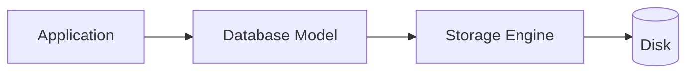
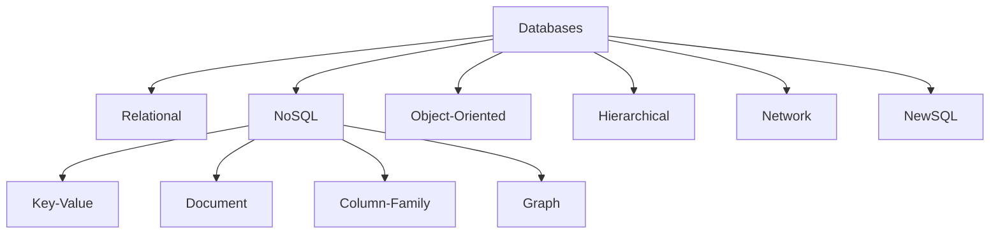
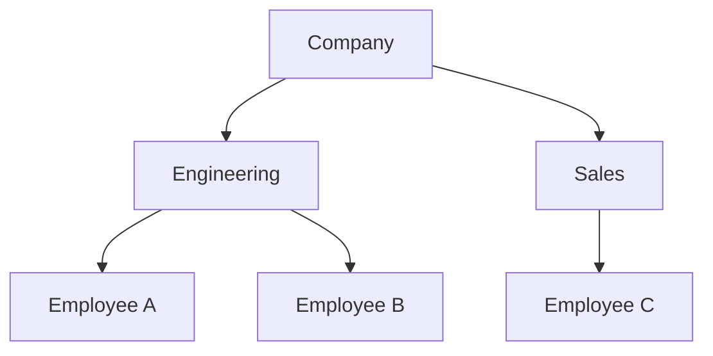
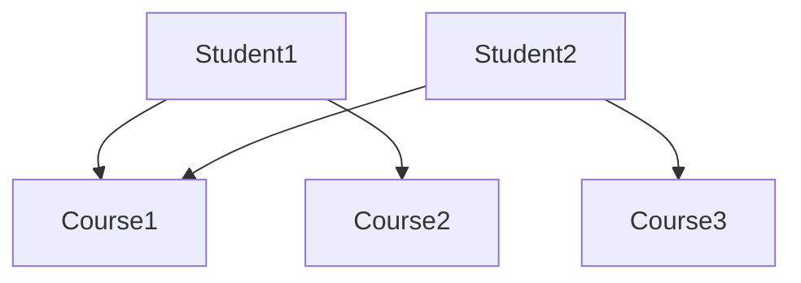
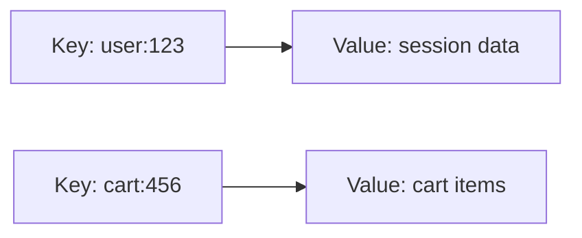
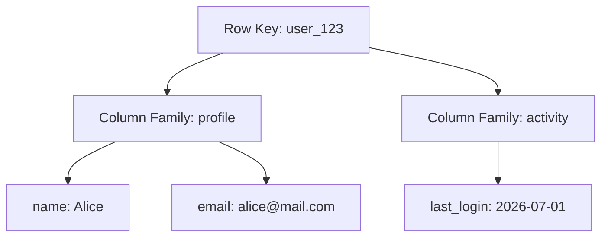
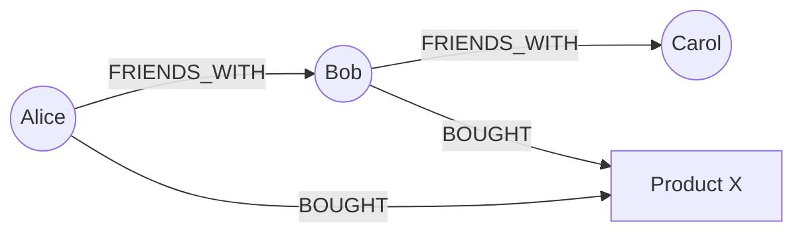
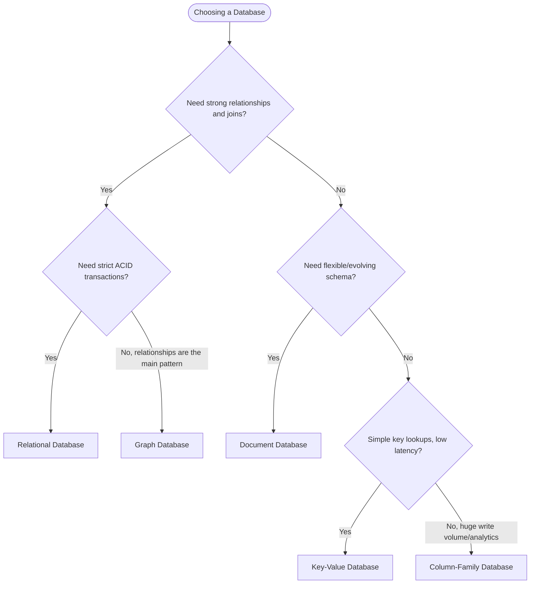
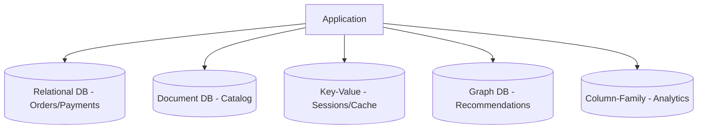

> [!important] A **database type** (or database model) defines how data is logically organized, how relationships between data are represented, and how queries are executed against it. Multiple database models exist because no single model efficiently satisfies every application's requirements — a social graph, a shopping cart, and a financial ledger have fundamentally different access patterns, consistency needs, and scaling profiles. Choosing the right database model is one of the most consequential early decisions in system design, because migrating between models later is expensive and risky.

---

# Introduction

Databases evolved directly out of the limitations of file systems (see [[DBMS vs File System]]). But even after the DBMS concept was established, a single "one-size-fits-all" model proved insufficient as applications diversified.

### Historical Timeline

1. **Hierarchical Databases (1960s)** — Data organized as a tree; e.g., IBM's IMS, used in early airline and banking systems.
2. **Network Databases (late 1960s-70s)** — Extended hierarchical models to allow many-to-many relationships via the CODASYL standard.
3. **Relational Databases (1970s-present)** — Introduced by Edgar Codd's relational model; data as tables with formal mathematical foundations. Dominant model for decades.
4. **Object-Oriented Databases (1980s-90s)** — Attempted to store objects directly, matching object-oriented programming languages.
5. **NoSQL Databases (2000s)** — Emerged from web-scale companies (Google, Amazon, Facebook) needing horizontal scalability and flexible schemas beyond what RDBMS offered at the time.
6. **NewSQL Databases (2010s-present)** — Attempt to combine ACID guarantees of relational databases with the horizontal scalability of NoSQL.

### Why One Model Cannot Solve Every Problem

- A **banking ledger** needs strict consistency and transactions -> relational
- A **shopping cart** needs extremely low-latency key lookups -> key-value
- A **social graph** needs efficient traversal of relationships -> graph
- **Sensor/analytics data** needs to ingest huge write volumes and scan by column -> column-family

Each of these access patterns has a database model _optimized_ for it. Forcing all of them into a single relational database is possible, but often inefficient at scale.

### Modern Trend: Polyglot Persistence

Modern large-scale systems rarely use just one database. They use **the right database for each subsystem** — this is called [[Polyglot Persistence|polyglot persistence]] and is now standard practice at FAANG-scale companies.

---

# Real-world Scenario

**Example: A Large E-commerce Platform**

|Component|Database Type|Why|
|---|---|---|
|Customer accounts, orders, payments|Relational (PostgreSQL)|Strong consistency, ACID transactions, well-defined relationships|
|Product catalog|Document (MongoDB)|Products have varying attributes (a shirt has size/color; a laptop has RAM/CPU) — flexible schema fits naturally|
|Shopping cart / session data|Key-Value (Redis)|Extremely low-latency reads/writes, simple get/set access pattern, ephemeral data|
|Product recommendations|Graph (Neo4j)|"Customers who bought X also bought Y" is a graph traversal problem|
|Clickstream / analytics|Column-family (Cassandra/HBase)|Massive write throughput, time-series/columnar scan patterns|
|Search|Search engine (Elasticsearch)|Full-text search and relevance ranking, not a core DBMS function|

A single relational database _could_ technically handle all of this, but would struggle with the graph traversal performance, the write throughput for analytics, and the flexible schema needs of the catalog — hence the move to **specialized databases per workload**.

> [!tip] Interview Tip When asked to design a system, proactively mention polyglot persistence: "I'd use Postgres for the transactional core, Redis for session/cache, and a search engine for product discovery" — this signals real-world system design maturity.

---

# What is a Database Model?

> [!important] Definition A database model defines the **logical structure** of data (how it's organized conceptually — tables, documents, graphs, key-value pairs), separate from the **physical storage model** (how bytes are actually laid out on disk) and the **query model** (the language/API used to interact with the data).

- **Logical organization** — tables vs. documents vs. nodes/edges vs. key-value pairs
- **Storage model vs. data model** — the data model is what the user sees; the storage engine decides physical layout (B-Trees, LSM-trees, etc.) — see [[Storage Engine]]
- **Query model** — SQL for relational, query DSLs for document stores, Cypher/Gremlin for graphs, simple GET/PUT for key-value
- **Relationships** — how connections between entities are represented and traversed
- **Trade-offs** — every model optimizes for certain access patterns at the cost of others (flexibility vs. consistency, read speed vs. write speed, relationships vs. horizontal scalability)



---

# Classification of Databases



---

# Relational Databases (RDBMS)

> [!important] Definition A relational database organizes data into **tables** (relations) consisting of **rows** (tuples) and **columns** (attributes), with relationships enforced via **primary** and **foreign keys**, queried using **SQL**, and typically guaranteeing **ACID** transactions.

|id|name|email|
|---|---|---|
|1|Alice|alice@mail.com|
|2|Bob|bob@mail.com|

- **Primary Key** — uniquely identifies each row (e.g., `id`)
- **Foreign Key** — references a primary key in another table, enforcing referential integrity
- **SQL** — declarative query language for retrieving/manipulating data
- **ACID Transactions** — see [[ACID]]
- **Normalization** — organizing tables to minimize redundancy, see [[Normalization]]

### Advantages

- Strong consistency and integrity guarantees
- Mature ecosystem, tooling, and query optimization
- Powerful joins across normalized data
- Well-understood, standardized (SQL)

### Limitations

- Vertical scaling is easier than horizontal scaling (though modern RDBMS increasingly support sharding/read replicas)
- Rigid schema requires migrations for structural changes
- Complex joins can become expensive at very large scale

### Real-world Example

A banking system storing accounts, transactions, and customers — where correctness and consistency are non-negotiable.

### Popular Databases

- **PostgreSQL** — feature-rich, open-source, strong standards compliance
- **MySQL** — widely used in web applications
- **Oracle DB** — enterprise-grade, heavily used in large legacy systems
- **SQL Server** — Microsoft ecosystem standard

See [[RDBMS]] for a deep dive.

---

# Hierarchical Databases

> [!important] Definition Data is organized as a **tree structure**, where each child record has exactly one parent, and relationships are navigated top-down.



- **Navigation** — access requires traversing from root to leaf; no direct access to arbitrary nodes without walking the tree
- **Advantages** — fast for strictly hierarchical data (e.g., org charts, file systems); simple conceptual model
- **Limitations** — cannot naturally represent many-to-many relationships (an employee belonging to two departments is awkward); rigid structure makes schema changes difficult
- **Use cases** — legacy banking/airline systems, XML data storage
- **Example** — **IBM IMS** (Information Management System), still used in some legacy mainframe banking systems today

---

# Network Databases

> [!important] Definition An extension of the hierarchical model allowing records to have **multiple parents**, forming a graph-like structure — standardized by the **CODASYL** model.



- **Many-to-many relationships** — a student can enroll in multiple courses, and a course can have multiple students, both represented natively
- **CODASYL model** — defined standard "sets" representing owner-member relationships between record types
- **Advantages** — more flexible than hierarchical for complex relationships; efficient navigation via pointers
- **Limitations** — complex to design and maintain; navigation-based access (rather than declarative queries) makes ad-hoc queries hard
- **Example databases** — Integrated Data Store (IDS), IDMS

> [!tip] Interview Tip Network and hierarchical databases are mostly historical/legacy context — interviewers rarely expect deep expertise here, just an understanding of _why_ the relational model was a breakthrough over them (declarative queries + data independence).

---

# Object-Oriented Databases

> [!important] Definition Data is stored as **objects**, directly mirroring object-oriented programming constructs — classes, inheritance, and encapsulation — enabling **persistence** of in-memory application objects without translation to tables.

- **Objects & Classes** — data and behavior bundled together, matching OOP application code
- **Inheritance** — object hierarchies map directly to database schema hierarchies
- **Encapsulation** — internal object state hidden behind methods
- **Persistence** — objects can be saved/loaded without an "object-relational mapping" translation layer

### Advantages

- Eliminates the "object-relational impedance mismatch" (no ORM translation needed)
- Natural fit for applications with complex, deeply nested object graphs (CAD systems, engineering software)

### Drawbacks

- Small ecosystem, limited tooling compared to RDBMS/NoSQL
- Poor standardization across vendors
- Rarely used in modern web-scale systems

### Real-world Use Cases

CAD/CAM systems, telecom, some scientific/engineering applications.

### Example

**ObjectDB** (Java-based object database).

---

# NoSQL Databases

> [!important] **NoSQL** ("Not Only SQL") databases emerged in the 2000s at companies like Google, Amazon, and Facebook, who needed to scale **horizontally** across thousands of commodity servers — something traditional RDBMS of that era struggled with — while also supporting flexible, rapidly evolving schemas.

- **Why NoSQL was introduced** — web-scale traffic volumes exceeded what single-node relational databases could handle efficiently; rigid schemas slowed down fast-iterating product teams
- **CAP Theorem motivation (high level)** — in a distributed system, you can't simultaneously guarantee Consistency, Availability, and Partition tolerance — NoSQL databases often explicitly trade strict consistency for availability and partition tolerance. See [[CAP Theorem]].
- **Horizontal scalability** — designed from the ground up to shard/distribute data across many nodes
- **Flexible schemas** — no rigid upfront schema; records can vary in structure

|Type|Data Model|Best For|Examples|
|---|---|---|---|
|Key-Value|Simple key -> value pairs|Caching, sessions, extremely low-latency lookups|Redis, DynamoDB, Riak|
|Document|JSON/BSON-like nested documents|Flexible/evolving schemas, content management|MongoDB, CouchDB|
|Column-Family|Wide sparse columns grouped into families|High write throughput, time-series, analytics|Cassandra, HBase, ScyllaDB|
|Graph|Nodes + edges + properties|Relationship-heavy data, traversal-heavy queries|Neo4j, Amazon Neptune|

---

# Key-Value Databases

> [!important] Definition The simplest NoSQL model — data is stored as a **key mapped directly to a value** (often an opaque blob), with no query capability beyond retrieval by key.



- **Structure** — hash-map-like: `key -> value`
- **Operations** — `GET`, `PUT`, `DELETE` — no joins, no complex queries
- **Time complexity** — O(1) average-case lookup, typically via hashing
- **Advantages** — extremely fast, simple, scales horizontally with ease
- **Disadvantages** — no relationships, no complex querying, application must manage structure within values

### Examples

- **Redis** — in-memory, used for caching, sessions, rate limiting
- **DynamoDB** — AWS-managed, supports a key-value interface (plus more advanced querying via secondary indexes)
- **Riak** — distributed key-value store built for high availability

---

# Document Databases

> [!important] Definition Data is stored as **self-contained documents** (typically JSON or BSON), which can be deeply nested and don't require a fixed schema across records.

```json
{
  "product_id": "P123",
  "name": "Running Shoes",
  "attributes": {
    "size": "10",
    "color": "black",
    "material": "mesh"
  },
  "reviews": [
    { "user": "alice", "rating": 5 },
    { "user": "bob", "rating": 4 }
  ]
}
```

- **Flexible schema** — different products can have entirely different attribute sets in the same collection
- **Nested documents** — related data can be embedded directly, avoiding joins for common access patterns
- **Advantages** — natural fit for semi-structured, evolving data; fast reads for whole-document retrieval
- **Limitations** — joins across documents are expensive/manual; consistency guarantees are often weaker than RDBMS by default

### Examples

- **MongoDB** — the most widely adopted document database
- **CouchDB** — document database with strong support for offline-first sync

---

# Column-Family Databases

> [!important] Definition Data is stored by **column** rather than by row, grouped into **column families**, allowing sparse rows (not every row needs every column) and efficient distributed storage across many nodes.



- **Wide-column storage** — millions of columns possible per table, most rows populate only a subset
- **Sparse rows** — unlike relational tables, rows don't need every column to have a value
- **Distributed storage** — designed for horizontal scale-out across commodity hardware with no single point of failure

### Examples

- **Cassandra** — masterless, highly available, tunable consistency
- **HBase** — built on top of HDFS, common in Hadoop ecosystems
- **ScyllaDB** — Cassandra-compatible, written in C++ for higher performance

### Why Used for Analytics & Massive Scale

Column-family databases excel at **write-heavy, append-mostly workloads** (e.g., time-series sensor data, clickstreams, logs) and at **scanning specific columns across huge datasets** without reading entire rows — ideal for analytics.

---

# Graph Databases

> [!important] Definition Data is represented as **nodes** (entities), **edges** (relationships), and **properties** (attributes on nodes/edges), optimized for efficient **traversal** of connected data.



- **Nodes** — entities (people, products, accounts)
- **Edges** — relationships between entities, which can themselves have properties (e.g., "since: 2020")
- **Properties** — key-value attributes attached to nodes/edges
- **Graph traversal** — following edges efficiently, e.g., "friends of friends," without expensive joins
- **Cypher queries (high level)** — Neo4j's declarative query language, e.g., `MATCH (a:Person)-[:FRIENDS_WITH]->(b:Person) RETURN b`

### Examples

- **Neo4j** — most widely adopted graph database
- **Amazon Neptune** — AWS-managed graph database supporting both property graphs and RDF

### Use Cases

- **Social networks** — friend/follower graphs
- **Fraud detection** — identifying suspicious rings of connected accounts/transactions
- **Recommendation systems** — "customers who bought X also bought Y" via graph traversal

---

# NewSQL Databases

> [!important] Definition NewSQL databases aim to provide the **ACID guarantees and relational model of traditional RDBMS**, combined with the **horizontal scalability of NoSQL** systems — attempting to get "the best of both worlds."

- **Why NewSQL emerged** — as applications grew, teams wanted relational consistency _and_ the scale-out capability that NoSQL offered, without giving up SQL and transactions
- **ACID + horizontal scalability** — achieved via techniques like distributed consensus (Raft/Paxos), automatic sharding, and distributed transactions
- **Differences from NoSQL** — NewSQL retains strong consistency and full SQL support by default, rather than trading consistency for availability

### Examples

- **CockroachDB** — inspired by Google Spanner, horizontally scalable, strongly consistent SQL database
- **TiDB** — MySQL-compatible, distributed SQL database
- **Google Spanner** — globally distributed, strongly consistent database using synchronized atomic clocks (TrueTime)

---

# Comparison of Database Types

|Feature|Relational|Key-Value|Document|Column|Graph|Object|
|---|---|---|---|---|---|---|
|Schema|Rigid, predefined|Schemaless|Flexible/semi-structured|Flexible, sparse columns|Flexible|Class-based|
|Relationships|Strong (foreign keys, joins)|None|Weak/embedded|Weak|Very strong (native)|Strong (object refs)|
|Transactions|Full ACID|Often limited|Often limited (varies)|Often limited/tunable|Varies by vendor|Varies|
|Scalability|Vertical (traditionally), horizontal with effort|Excellent horizontal|Good horizontal|Excellent horizontal|Moderate|Limited|
|Query language|SQL|Simple GET/PUT|Query DSL / aggregation|CQL / API-based|Cypher / Gremlin|OQL|
|Performance|Great for complex queries/joins|Extremely fast simple lookups|Fast document retrieval|Fast writes, columnar scans|Fast traversals|Varies|
|Consistency|Strong|Tunable (often eventual)|Tunable|Tunable|Strong (typically)|Strong|
|Best use case|Transactional systems|Caching, sessions|Content/catalogs|Analytics, time-series|Relationship-heavy data|CAD/engineering|
|Flexibility|Low|High|High|Moderate|High|Moderate|
|Learning curve|Moderate (SQL widely known)|Low|Low-moderate|Moderate|Moderate-high|High|

---

# SQL vs NoSQL

|Aspect|SQL (Relational)|NoSQL|
|---|---|---|
|Schema|Fixed, defined upfront|Dynamic, flexible|
|Scaling|Primarily vertical (though modern RDBMS support sharding)|Primarily horizontal, built for scale-out|
|Transactions|Full ACID by default|Often BASE (Basically Available, Soft state, Eventual consistency); some support ACID|
|Consistency|Strong consistency|Often eventual consistency (tunable in many systems)|
|Query language|Standardized SQL|Varies by database (no universal standard)|
|Joins|Native, powerful|Typically unsupported or manual|
|Flexibility|Low — schema migrations required for changes|High — documents/rows can vary in structure|
|Typical applications|Banking, ERP, anything needing strong consistency|Social media feeds, catalogs, caching, big data|
|Examples|PostgreSQL, MySQL, Oracle|MongoDB, Cassandra, Redis, Neo4j|

> [!tip] When to Prefer Each Prefer **SQL** when data is highly structured, relationships matter, and strong consistency is required (financial transactions). Prefer **NoSQL** when you need to scale horizontally, handle flexible/evolving schemas, or optimize for a specific access pattern (fast key lookups, deep traversal, huge write throughput).

---

# Choosing the Right Database

Factors to weigh:

- **Data structure** — tabular/relational vs. document vs. graph vs. simple key-value
- **Relationships** — how interconnected is the data, and how often are relationships queried?
- **Read/write ratio** — read-heavy vs. write-heavy workloads favor different engines
- **Consistency requirements** — strict (financial) vs. eventual (social feed) consistency
- **Scalability** — expected data volume and growth trajectory
- **Latency** — how fast must reads/writes be?
- **Availability** — how tolerant is the system to downtime vs. inconsistency?
- **Analytics needs** — OLTP vs. OLAP workload characteristics
- **Cost** — licensing, infrastructure, and operational overhead
- **Team expertise** — operational maturity with a given technology matters in practice



---

# Industry Examples

## Banking

Relational databases (Oracle, PostgreSQL) dominate due to strict ACID requirements and regulatory needs for consistency and auditability.

## E-commerce

Polyglot: relational for orders/payments, document for catalog, key-value for cart/session, graph for recommendations.

## Social Media

Graph databases (or graph-like data models built atop other stores) for the social graph; column-family databases for feeds/timelines at massive write scale.

## Messaging Apps

Key-value/column stores for message storage at scale (e.g., Cassandra at large messaging companies); relational for user account data.

## IoT

Time-series and column-family databases (e.g., Cassandra, InfluxDB) to handle massive sensor write throughput.

## Gaming

Key-value/document databases for player profiles and session state; relational for billing/transactions.

## Healthcare

Relational databases for strict integrity/compliance (HIPAA); document databases sometimes used for flexible clinical records.

## Enterprise ERP

Relational databases remain dominant due to complex, well-defined business relationships and transactional integrity requirements.

---

# Polyglot Persistence

> [!important] Definition **Polyglot persistence** is the practice of using multiple, different database technologies within a single application or system, each chosen to fit a specific subsystem's access patterns — rather than forcing one database to handle every workload.

### Benefits

- Each component uses the database best suited to its access pattern
- Improved performance and scalability per-subsystem
- Teams can iterate independently on different data stores

### Challenges

- Increased operational complexity (more systems to monitor, back up, secure)
- Data consistency across stores becomes harder (no cross-database transactions by default)
- Requires broader team expertise across multiple technologies



---

# Advantages and Disadvantages of Each Database Type

|Database Type|Advantages|Disadvantages|
|---|---|---|
|Relational|Strong consistency, mature tooling, powerful joins|Harder to scale horizontally, rigid schema|
|Key-Value|Extremely fast, simple, highly scalable|No relationships, minimal query capability|
|Document|Flexible schema, natural fit for nested data|Weak cross-document relationships, eventual consistency common|
|Column-Family|Massive write throughput, great for analytics|Complex data modeling, limited ad-hoc query flexibility|
|Graph|Excellent for relationship traversal|Less efficient for non-relationship-heavy workloads|
|Object-Oriented|No ORM mismatch, matches OOP code|Poor ecosystem/standardization, niche adoption|
|NewSQL|ACID + horizontal scale|Newer, smaller ecosystems, added operational complexity|

---

# Performance Comparison

- **Reads** — key-value databases offer the fastest simple reads; relational databases are fastest for complex, filtered, joined reads with proper indexing
- **Writes** — column-family databases (LSM-tree based) typically offer the highest write throughput
- **Joins** — relational databases excel; NoSQL databases generally avoid or minimize joins by design
- **Horizontal scaling** — NoSQL and NewSQL databases are built for this; traditional RDBMS require more engineering effort (sharding, read replicas)
- **Vertical scaling** — traditional RDBMS historically rely more heavily on scaling up a single powerful server
- **Indexing** — all major database types support secondary indexes, but the underlying structures differ (B-Trees in RDBMS, LSM-trees in many NoSQL systems) — see [[Indexes]] and [[Storage Engine]]
- **Memory usage** — key-value stores like Redis are often fully in-memory, trading cost for speed

> [!tip] Interview Tip Be ready to explain _why_ LSM-trees (common in Cassandra/HBase) favor writes, while B-Trees (common in PostgreSQL/MySQL) balance reads and writes more evenly — this is a favorite deep-dive question.

---

# Database Type Selection Cheat Sheet

|Requirement|Recommended Database|
|---|---|
|Banking / financial transactions|Relational (PostgreSQL, Oracle)|
|Cache|Key-Value (Redis)|
|User sessions|Key-Value (Redis, DynamoDB)|
|Product catalog|Document (MongoDB)|
|Social graph|Graph (Neo4j, Amazon Neptune)|
|Time-series data|Column-Family (Cassandra) or specialized time-series DB (InfluxDB)|
|Analytics / big data|Column-Family (Cassandra, HBase) or OLAP warehouse|
|Logging|Column-Family or append-only log store (Cassandra, Elasticsearch)|
|CMS (content management)|Document (MongoDB, CouchDB)|
|ERP|Relational (Oracle, SQL Server)|

---

# Interview Perspective

FAANG interviewers, particularly in system design rounds, expect candidates to:

- Explain **why NoSQL exists** — as a response to horizontal scalability and flexible schema needs that traditional RDBMS of the 2000s struggled to meet
- Compare **SQL vs. NoSQL** fluently, including consistency/transaction trade-offs
- Show basic **CAP theorem awareness** — understanding that distributed systems trade off consistency and availability under partition
- Demonstrate **database choice reasoning in system design** — justify a database choice based on the specific access pattern, not just familiarity
- Discuss **real-world trade-offs** — no database is "best"; the right choice depends on the workload

> [!tip] Interview Tip A strong system design answer often includes a brief justification like: "Given this is a write-heavy, append-only analytics workload, I'd choose a column-family store like Cassandra over a relational database, because LSM-tree-based storage handles high write throughput more efficiently than B-Tree-based storage."

---

# Interview Questions

1. **What are the major types of databases?** Relational, hierarchical, network, object-oriented, and NoSQL (key-value, document, column-family, graph), plus NewSQL.
    
2. **Difference between SQL and NoSQL?** SQL databases are relational, schema-rigid, and strongly consistent; NoSQL databases are typically schema-flexible, horizontally scalable, and often favor eventual consistency.
    
3. **Why was NoSQL introduced?** To address horizontal scalability and schema flexibility needs that traditional RDBMS struggled with at web scale in the 2000s.
    
4. **When would you choose MongoDB?** When data has a flexible, evolving structure (e.g., product catalogs with varying attributes) and strict relational joins aren't the primary access pattern.
    
5. **Why are graph databases useful?** They natively model and efficiently traverse relationships (e.g., social connections, fraud rings) without the expensive multi-way joins relational databases would require.
    
6. **What is a key-value database?** A database storing data as simple key-to-value mappings, optimized for extremely fast lookups with no relational querying capability.
    
7. **Explain wide-column databases.** Databases that store data by column rather than by row, grouped into column families, allowing sparse rows and efficient distributed storage — ideal for write-heavy, large-scale workloads.
    
8. **What is NewSQL?** A class of databases that combine ACID transactional guarantees and SQL support with the horizontal scalability typically associated with NoSQL systems.
    
9. **Which database would you choose for banking?** A relational database, due to the need for strict ACID transactions, strong consistency, and regulatory auditability.
    
10. **Can one application use multiple databases?** Yes — this is called polyglot persistence, where different subsystems use the database best suited to their specific access pattern.
    
11. **What is the CAP theorem, at a high level?** In a distributed system, you can guarantee at most two of Consistency, Availability, and Partition tolerance simultaneously during a network partition.
    
12. **Why don't NoSQL databases typically support joins well?** Their storage models are designed for horizontal distribution across nodes, where cross-node joins are expensive; instead, they favor denormalization and embedding related data together.
    
13. **What is denormalization, and why is it common in NoSQL?** Intentionally duplicating data to avoid expensive joins, trading storage space and update complexity for faster reads — common in document and column-family databases.
    
14. **What is eventual consistency?** A consistency model where, given enough time without new updates, all replicas of data will converge to the same value — common in distributed NoSQL systems that prioritize availability.
    
15. **How does a graph database differ from a relational database with foreign keys?** Graph databases treat relationships as first-class citizens optimized for traversal (constant-time edge-following), while relational databases must compute joins at query time, which grows more expensive with depth.
    
16. **What is a column family?** A grouping of related columns within a wide-column database, analogous to a table in relational databases but with a much more flexible, sparse schema.
    
17. **Why might you choose Cassandra over PostgreSQL for an IoT application?** Cassandra's LSM-tree storage and masterless architecture handle extremely high write throughput and horizontal scale better than a single-node relational database.
    
18. **What is Google Spanner, and why is it notable?** A globally distributed NewSQL database offering strong consistency and SQL support across geographically distributed nodes, using synchronized clocks (TrueTime) to order transactions.
    
19. **What are the risks of polyglot persistence?** Increased operational complexity, harder cross-database consistency, and the need for broader team expertise across multiple systems.
    
20. **How would you decide between a document database and a relational database for a new project?** Consider whether relationships/joins are central to the access pattern (favor relational) or whether the schema is expected to be flexible/evolving with limited cross-entity joins (favor document).
    

---

# Common Mistakes

> [!warning] "NoSQL means no SQL support." Many NoSQL databases support SQL-like query languages (e.g., Cassandra Query Language). "NoSQL" today is generally understood as "Not Only SQL," not "no SQL at all."

> [!warning] "MongoDB is always faster than PostgreSQL." Performance depends entirely on the access pattern. Relational databases can outperform document databases for complex, join-heavy queries with proper indexing.

> [!warning] "Relational databases cannot scale." Modern RDBMS support read replicas, sharding, and partitioning — horizontal scaling is possible, just historically less automatic than in NoSQL systems.

> [!warning] "Graph databases replace relational databases." Graph databases excel at relationship-heavy traversal but are a poor fit for general transactional workloads — they complement, not replace, relational databases.

> [!warning] "One database type is best for every application." The right choice is always workload-dependent; polyglot persistence exists precisely because no single database excels at everything.

---

# Revision Notes

- Major categories: Relational, Hierarchical, Network, Object-Oriented, NoSQL (Key-Value, Document, Column-Family, Graph), NewSQL
- SQL = structured, consistent, relationship-rich; NoSQL = flexible, horizontally scalable, workload-specialized
- Key-Value -> caching/sessions; Document -> catalogs/CMS; Column-Family -> analytics/high write throughput; Graph -> relationships/traversal
- NewSQL = ACID + horizontal scalability (CockroachDB, Spanner, TiDB)
- CAP theorem: pick 2 of Consistency, Availability, Partition tolerance during a network partition
- Polyglot persistence = using the right database per subsystem
- Selection criteria: data structure, relationships, consistency needs, scale, latency, cost, team expertise
- Interview keywords: ACID, BASE, CAP theorem, horizontal vs vertical scaling, eventual consistency, denormalization

---

# Summary

- Database models evolved from hierarchical -> network -> relational -> object-oriented -> NoSQL -> NewSQL, each solving limitations of the last.
- No single database model is best for every workload — choice depends on relationships, consistency needs, and scale.
- Relational databases excel at strong consistency and complex relationships; NoSQL variants specialize in scale, flexibility, or specific access patterns.
- Key-Value, Document, Column-Family, and Graph databases each optimize for a distinct access pattern.
- NewSQL attempts to combine relational guarantees with NoSQL-style horizontal scalability.
- Polyglot persistence — using multiple specialized databases in one system — is standard practice at scale.
- CAP theorem underlies most distributed NoSQL consistency trade-offs.
- Database selection should be driven by workload characteristics, not familiarity or trend.
- FAANG interviews expect justified, trade-off-aware database choices in system design.
- Understanding this landscape is foundational for both interviews and real-world architecture decisions.

---

# Related Notes

- [[What is DBMS]]
- [[DBMS vs File System]]
- [[RDBMS]]
- [[Normalization]]
- [[SQL]]
- [[NoSQL]]
- [[CAP Theorem]]
- [[ACID]]
- [[Indexes]]
- [[Transactions]]
- [[Storage Engine]]
- [[Database Design]]