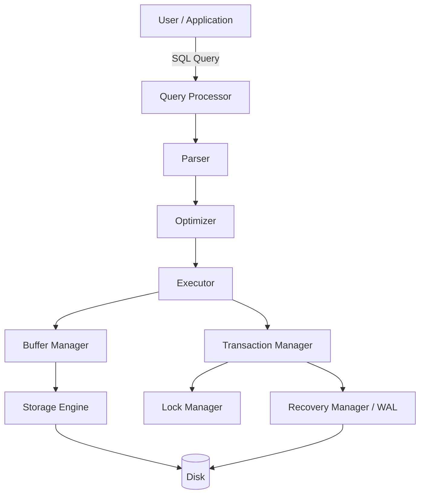
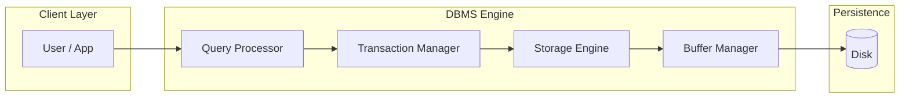
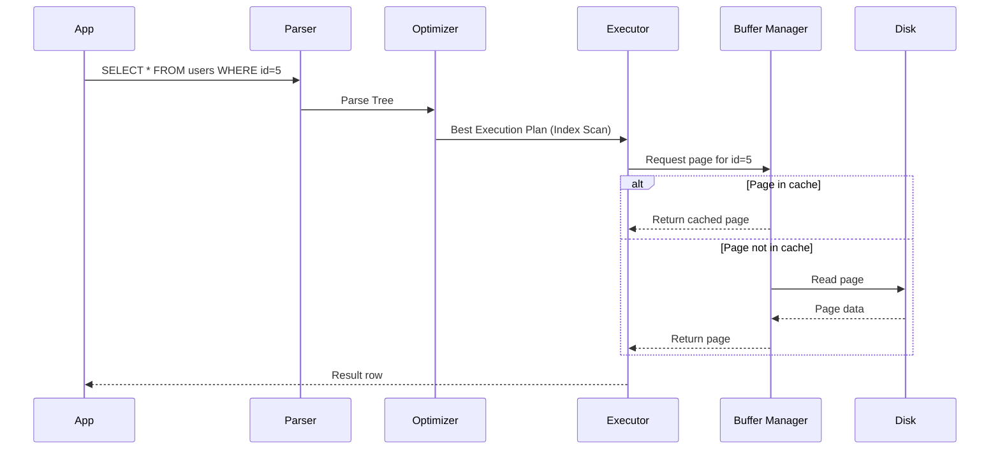

> [!important] Definition A **Database Management System (DBMS)** is software that sits between an application and physical storage, providing a controlled, efficient, and safe way to **create, read, update, delete, and manage data**. It abstracts away the messy details of disks, files, and byte offsets, and instead exposes data as structured, queryable, and consistent — even when hundreds of clients are reading and writing at the same time.

In one sentence: **a DBMS turns "a pile of bytes on disk" into "a reliable, queryable, concurrent, crash-safe data service."**

Every relational database you've heard of — PostgreSQL, MySQL, Oracle, SQL Server — is a DBMS. So are non-relational systems like MongoDB or Redis, though this vault focuses primarily on relational DBMSs (RDBMS), since that's what FAANG interviews test most heavily.

---

# Why Do We Need a DBMS?

Before DBMSs existed (and in systems that still avoid them), applications stored data directly in **flat files** — plain text files, CSVs, or custom binary formats — managed manually by the application code. This sounds simple, but it breaks down fast at any real scale.

### Problem 1: Data Redundancy and Inconsistency

Imagine a university storing student records in two separate files: one for the Library department and one for the Accounts department. Both store the student's name and address independently.

- If a student moves house, someone has to update **both** files.
- If only one gets updated, you now have **two different addresses** for the same student — an inconsistency with no way to know which one is correct.

A DBMS centralizes data so there's a single source of truth.

### Problem 2: Difficulty in Accessing Data

With flat files, every new type of query requires **new application code**. Want to find "all students who scored above 90 in Physics"? Someone has to write a custom program to scan the file, parse each line, and filter it — every single time a new question is asked.

A DBMS gives you a **declarative query language (SQL)** — you describe _what_ you want, not _how_ to get it.

### Problem 3: Data Isolation

Data is scattered across multiple files in multiple formats, making it hard to write applications that pull data from more than one source at once.

### Problem 4: Integrity Problems

Suppose a business rule says "account balance must never go below zero." In a flat-file system, that constraint has to be manually re-implemented in **every single program** that touches the balance field. Miss one, and the rule is silently violated.

A DBMS lets you declare constraints (`CHECK`, `NOT NULL`, `FOREIGN KEY`) **once**, and the DBMS enforces them everywhere, always.

### Problem 5: Atomicity Problems

Consider a bank transfer: subtract ₹500 from Account A, add ₹500 to Account B. What happens if the system crashes **after** the subtraction but **before** the addition? In a flat-file system, you've just destroyed ₹500. There's no built-in notion of "this must happen completely or not at all."

A DBMS provides **transactions** — a group of operations that either fully commit or fully roll back.

### Problem 6: Concurrent Access Anomalies

Two people booking the last seat on a flight at the exact same time, using file-based storage with no coordination, can both succeed — resulting in overbooking. A DBMS uses **concurrency control** (locks, MVCC) to prevent this.

### Problem 7: Security Problems

File systems typically offer coarse permissions (read/write/execute at the OS level). A DBMS offers **fine-grained access control** — a user can be allowed to `SELECT` from a `salary` column but denied `UPDATE`, for example.

> [!tip] Interview Tip If asked "why not just use files?", structure your answer around these seven problems: **redundancy, access difficulty, isolation, integrity, atomicity, concurrency, and security.** Interviewers love candidates who can enumerate this cleanly instead of vaguely saying "it's better."

---

# Real-world Analogy

Think of a DBMS like the **manager of a busy warehouse**.

Without a manager, workers would just dump boxes anywhere, forget where things are, sometimes pick up the same item twice, and occasionally two workers might grab the last unit of a product at once and both promise it to different customers.

A good warehouse manager:

- Knows exactly where every item is (**storage & indexing**)
- Enforces rules like "you can't ship more units than we have in stock" (**constraints**)
- Makes sure that if a shipment is only half-packed when the truck breaks down, it doesn't go out incomplete (**atomicity**)
- Coordinates workers so two people don't grab the same last item simultaneously (**concurrency control**)
- Keeps a logbook so that if there's a fire, the warehouse's exact state can be reconstructed (**recovery via WAL**)
- Decides who's allowed into the "high value goods" section (**security**)

The DBMS is that manager — except it manages _data_ instead of boxes, and it does it for potentially millions of "workers" (queries) every second.

---

# Key Responsibilities of a DBMS

|Responsibility|What It Means|
|---|---|
|**Data Storage**|Persisting data reliably on disk (or memory) in an organized format|
|**Data Retrieval**|Efficiently finding and returning requested data|
|**Data Security**|Authentication, authorization, and encryption to protect data|
|**Transactions**|Grouping operations so they're all-or-nothing (ACID)|
|**Concurrency**|Allowing many users to read/write simultaneously without corrupting data|
|**Backup**|Creating restorable copies of data to survive disasters|
|**Recovery**|Restoring the database to a consistent state after a crash|
|**Indexing**|Building auxiliary structures (like B-Trees) for fast lookups|
|**Query Optimization**|Choosing the fastest execution plan for a given query|

### Data Storage

The DBMS decides how rows are physically laid out on disk — row-oriented (Postgres, MySQL) vs column-oriented (Redshift, BigQuery) — and manages pages, extents, and free space.

### Data Retrieval

Given a query, the DBMS must locate the relevant rows as fast as possible, using indexes, statistics, and cost-based decisions rather than scanning everything blindly.

### Data Security

This spans authentication (who are you?), authorization (what can you do?), and often encryption at rest and in transit.

### Transactions

The DBMS guarantees that a transaction either fully happens or doesn't happen at all — this is the foundation of the "A" in ACID. See [[ACID]].

### Concurrency

Multiple users acting on the same data at once must not corrupt it or see impossible intermediate states. See [[Concurrency Control]].

### Backup & Recovery

The DBMS must survive power failures, disk crashes, and application bugs — using techniques like Write-Ahead Logging (WAL), checkpoints, and replication.

### Indexing

Without indexes, every query is a full table scan — O(n). Indexes like B-Trees bring this down to O(log n). See [[Indexes]].

### Query Optimization

SQL is _declarative_ — you say what you want, and the **query optimizer** decides the fastest _how_, picking join orders, join algorithms, and access paths.

---

# Core Components

> [!important] Mental Model A DBMS is not one monolithic program — it's a pipeline of specialized subsystems, each with a narrow job, working together.

|Component|Role|
|---|---|
|**Database**|The actual collection of stored data (the "what")|
|**DBMS Software**|The engine that manages the database (the "who")|
|**Query Processor**|Parses, validates, optimizes, and executes SQL|
|**Storage Manager**|Manages how/where data is physically stored on disk|
|**Buffer Manager**|Caches disk pages in memory to avoid slow disk I/O|
|**Transaction Manager**|Ensures ACID properties for every transaction|
|**Recovery Manager**|Restores a consistent state after crashes, using logs|
|**Catalog / Metadata (System Catalog)**|Stores schema info: table definitions, column types, indexes, constraints|

### Query Processor

Breaks down into: **Parser** (syntax check) → **Binder/Analyzer** (resolves table/column names against the catalog) → **Optimizer** (picks the cheapest execution plan) → **Executor** (runs the plan).

### Storage Manager

Handles the on-disk file format — organizing data into fixed-size **pages** (commonly 8KB in PostgreSQL, 16KB in MySQL/InnoDB), which are grouped into **extents** and **tablespaces**.

### Buffer Manager

RAM is orders of magnitude faster than disk. The buffer manager (aka **buffer pool**) keeps hot pages in memory using eviction policies like LRU, dramatically reducing disk I/O for frequently accessed data.

### Transaction Manager

Tracks the lifecycle of every transaction — `BEGIN`, `COMMIT`, `ROLLBACK` — and coordinates with the lock manager and recovery manager to uphold ACID.

### Recovery Manager

Uses the **Write-Ahead Log (WAL)** — every change is logged _before_ it's applied to the actual data files — so that after a crash, the DBMS can replay (redo) or undo operations to reach a consistent state.

### Catalog / Metadata

The "database about the database" — table schemas, data types, index definitions, user privileges, and statistics used by the optimizer (like row counts and column value distributions).

---

# Architecture



A simplified layered view:



> [!tip] Interview Tip Being able to **draw this diagram from memory** and explain the flow of a query through it is one of the highest-leverage things you can do for a DBMS-internals interview question.

---

# How a Query Works

Let's trace exactly what happens when you run:

```sql
SELECT * FROM users WHERE id = 5;
```

### Step 1: Connection & Session

The client connects to the DBMS server (often over TCP), authenticates, and the DBMS allocates a session/process to handle it.

### Step 2: Parsing

The **parser** checks the SQL for syntax errors and converts the text into a **parse tree** (an internal, structured representation).

### Step 3: Semantic Analysis / Binding

The DBMS checks the **catalog**: does the `users` table exist? Does it have an `id` column? Are the types compatible with the literal `5`? This produces a validated, "bound" query tree.

### Step 4: Query Optimization

The optimizer looks at available access paths:

- **Full table scan** — read every row and check `id = 5`
- **Index scan** — if an index exists on `id` (which it does, since it's typically the primary key), jump straight to the matching row(s)

Using statistics (row counts, index selectivity), the optimizer picks the cheapest plan — almost always the index scan here, since it filters on the primary key.

### Step 5: Execution

The **executor** runs the chosen plan. It asks the **buffer manager** for the relevant page(s).

### Step 6: Buffer Pool Check

The buffer manager checks: is this page already cached in memory?

- **Cache hit** → return the in-memory page immediately.
- **Cache miss** → the storage engine fetches the page from disk into the buffer pool, potentially evicting a less-recently-used page.

### Step 7: Row Retrieval

The row(s) matching `id = 5` are extracted from the page and passed up.

### Step 8: Transaction Context

All of this happens inside an implicit or explicit transaction. If this were inside a larger transaction (e.g. part of a `BEGIN ... COMMIT` block), the transaction manager ensures the correct isolation level is respected (e.g. this read might take a shared lock, or read an MVCC snapshot, depending on the engine).

### Step 9: Result Formatting & Return

The row is formatted according to the client protocol (e.g. the PostgreSQL wire protocol) and streamed back to the application.



> [!important] Key Insight The entire reason indexes, buffer pools, and optimizers exist is to avoid the naive approach: **scanning every row on disk for every query.** Understanding this pipeline is the difference between memorizing SQL syntax and actually understanding database _performance_.

---

# Characteristics

- **Self-Describing Nature**: A DBMS doesn't just store data — it stores data _about_ the data (the schema/catalog) in the same system.
- **Data Abstraction**: Users interact with data through logical views, not physical storage details (see [[ACID]] and three-level schema architecture).
- **Data Independence**: You can change the physical storage without changing application code (physical independence), or change the logical schema without breaking every query (logical independence, to a degree).
- **Multiple Views**: Different users can see different, tailored views of the same underlying data.
- **Concurrent Access**: Many users can safely use the database simultaneously.
- **Data Integrity**: Constraints (keys, foreign keys, checks) are enforced centrally.
- **Controlled Redundancy**: Some redundancy may be allowed intentionally (e.g. denormalization for performance), but it's _controlled_, not accidental.
- **Security & Access Control**: Fine-grained permissions per user/role.
- **Backup & Recovery**: Built-in mechanisms to survive failures.

---

# Advantages

|Advantage|Explanation|
|---|---|
|**Reduced Redundancy**|Centralized storage avoids duplicate, inconsistent copies of data|
|**Data Consistency**|Constraints and transactions keep data valid at all times|
|**Data Sharing**|Many applications/users can access the same data safely|
|**Improved Security**|Fine-grained, role-based access control|
|**Efficient Query Processing**|Optimizers and indexes make retrieval fast|
|**Backup & Recovery Built-in**|Crash recovery, replication, point-in-time restore|
|**Concurrent Access**|Safe simultaneous reads/writes via concurrency control|
|**Data Independence**|Application code is insulated from storage-level changes|
|**Enforced Integrity**|Business rules enforced once, centrally, not per-application|
|**Scalability Options**|Read replicas, sharding, partitioning for growth|

---

# Disadvantages

- **Cost**: Commercial DBMSs (Oracle, SQL Server Enterprise) can be very expensive to license; even open-source options need skilled engineers to run well.
- **Complexity**: Learning curve for SQL, tuning, replication, and administration is real.
- **Hardware Requirements**: High-performance DBMSs often need substantial RAM/CPU/disk I/O capacity.
- **Single Point of Failure Risk**: A poorly architected DBMS deployment (no replicas) becomes a single point of failure for the whole system.
- **Performance Overhead**: The abstractions (transactions, locking, logging) that provide safety also add overhead compared to raw, unsafe file I/O.
- **Migration Difficulty**: Moving from one DBMS to another (e.g. Oracle → PostgreSQL) can require significant schema and query rewriting.

> [!warning] Common Misconception "A DBMS is always better than files" — not true. For genuinely simple, single-user, unstructured, or throwaway data (e.g. a local config file, a one-off script's scratch data), a flat file is simpler and has zero overhead. The DBMS earns its cost when you need integrity, concurrency, or complex querying.

---

# Common DBMS Software

|DBMS|Type|Commonly Used For|
|---|---|---|
|**PostgreSQL**|Open-source RDBMS|General-purpose, complex queries, strong standards-compliance, JSON support, extensibility (used heavily in startups and increasingly at big tech)|
|**MySQL**|Open-source RDBMS|Web applications, read-heavy workloads, historically the "LAMP stack" default; widely used at scale (e.g. historically at Facebook/Meta)|
|**SQL Server**|Commercial RDBMS (Microsoft)|Enterprise environments already invested in the Microsoft ecosystem (.NET, Azure)|
|**Oracle**|Commercial RDBMS|Large enterprises, banking, telecom — mission-critical systems needing advanced features and enterprise support|
|**SQLite**|Embedded, serverless RDBMS|Mobile apps, embedded systems, local caches, small single-user tools — an entire database in a single file, no server process|
|**MariaDB**|Open-source RDBMS (MySQL fork)|Drop-in MySQL replacement with community-driven development, used where vendor independence from Oracle (which owns MySQL) matters|

> [!tip] Interview Tip If asked "which database would you choose for X," anchor your answer on **workload characteristics** — read/write ratio, consistency needs, scale, and operational complexity — rather than naming a database because it's trendy.

---

# DBMS vs File System

|Aspect|File System|DBMS|
|---|---|---|
|Data Redundancy|High|Minimized (controlled)|
|Data Consistency|Not guaranteed|Enforced via constraints|
|Querying|Manual, program-based|Declarative (SQL)|
|Concurrency Control|Little to none|Built-in (locks/MVCC)|
|Backup & Recovery|Manual|Built-in|
|Security|Coarse (OS-level)|Fine-grained (row/column/role)|
|Atomicity|Not guaranteed|Guaranteed via transactions|
|Data Integrity|Application-enforced|System-enforced|

> See [[DBMS vs File System]]

---

# Types of Users

|User Type|Role|
|---|---|
|**Database Administrator (DBA)**|Manages the DBMS itself — installation, tuning, backups, security policies, user provisioning|
|**Application Developer**|Writes application code and queries that interact with the database|
|**End User**|Interacts with the database indirectly through an application's UI (e.g. a customer using a banking app)|
|**Data Analyst / Data Scientist**|Runs analytical queries, builds reports/dashboards, often via read replicas or data warehouses|
|**Sophisticated / Casual Users**|Users who write ad-hoc SQL queries directly (analysts, engineers debugging production)|

---

# Important Terminology

|Term|Meaning|
|---|---|
|**Schema**|The overall logical structure/blueprint of the database — table definitions, columns, types, constraints — largely static over time|
|**Instance**|The actual data stored in the database _at a given moment_ — changes constantly as data is inserted/updated/deleted|
|**Relation**|The formal (mathematical/relational-model) term for a **table**|
|**Tuple**|The formal term for a **row** in a relation|
|**Attribute**|The formal term for a **column** in a relation|
|**Record**|A row of data as physically stored (often used interchangeably with tuple in practice)|
|**Field**|A single value within a record — corresponds to an attribute/column value|

> [!tip] Interview Tip Interviewers sometimes deliberately use formal terms (relation, tuple, attribute) instead of table/row/column to see if you're comfortable with both vocabularies. Know the mapping cold: **relation = table, tuple = row, attribute = column.**

---

# Interview Questions

**1. What is a DBMS?** Software that manages storage, retrieval, and administration of data, providing abstraction, consistency, concurrency, and security on top of raw physical storage.

**2. What is the difference between DBMS and RDBMS?** A DBMS manages data generally (files, hierarchical, network models included); an RDBMS specifically organizes data into related tables following the relational model, and enforces relational integrity constraints (keys, foreign keys). All RDBMSs are DBMSs, not vice versa.

**3. Why use a DBMS instead of flat files?** Reduced redundancy, enforced consistency, atomic transactions, concurrent access safety, centralized security, and declarative querying (see the "Why Do We Need a DBMS" section above).

**4. What are the main components of a DBMS?** Query processor, storage manager, buffer manager, transaction manager, recovery manager, and the system catalog.

**5. Explain data independence.** The ability to change the schema at one level without requiring changes at another level. _Physical_ independence: change storage/indexes without altering application logic. _Logical_ independence: add/remove tables/columns without breaking unrelated application code (harder to achieve fully in practice).

**6. What is the difference between schema and instance?** Schema is the structural design (relatively static); instance is the actual data at a specific point in time (constantly changing).

**7. What happens internally when you run a SELECT query?** Parsing → semantic analysis/binding against the catalog → query optimization (choosing an execution plan) → execution (index/table scan via the storage & buffer manager) → result returned to client. (See the full walkthrough above.)

**8. What is the buffer pool, and why does it matter?** An in-memory cache of disk pages. Since disk I/O is orders of magnitude slower than RAM access, the buffer pool avoids redundant disk reads for frequently accessed pages, dramatically improving performance.

**9. What is Write-Ahead Logging (WAL) and why is it needed?** A durability technique where changes are written to a sequential log _before_ being applied to the actual data files. If the system crashes, the log can be replayed to redo committed changes or undo uncommitted ones, ensuring consistency without requiring every write to sync to the final data file immediately.

**10. What's the difference between a table scan and an index scan?** A table scan reads every row in a table to find matches — O(n). An index scan uses an auxiliary structure (usually a B-Tree) to jump directly to matching rows — O(log n) plus the cost of retrieving matched rows.

**11. What is the role of the query optimizer?** To choose the cheapest execution plan among many logically equivalent options, using statistics like row counts, index selectivity, and data distribution — since SQL is declarative and doesn't specify _how_ to execute the query.

**12. What is a transaction?** A logical unit of work composed of one or more operations that must execute completely (commit) or not at all (rollback), preserving the ACID properties.

**13. What does "data abstraction" mean in the context of a DBMS?** Hiding the complexity of how data is physically stored and letting users/applications interact with a simpler, logical view (tables, rows) instead of raw bytes, files, and pointers.

**14. Give an example of controlled redundancy.** Deliberately storing a denormalized, precomputed column (like `total_order_value`) alongside normalized order-line data, to speed up reads at the cost of needing to keep it in sync on writes — a conscious trade-off, unlike accidental redundancy in flat files.

**15. What's the difference between a DBA and a developer's responsibilities?** A DBA manages the database system itself (performance tuning, backups, security, provisioning); a developer designs schemas and writes application-level queries/logic that use the database.

**16. Can you have a DBMS without SQL?** Yes — NoSQL databases (MongoDB, Redis, Cassandra) are DBMSs that don't use SQL as their primary query interface, though many now offer SQL-like query layers.

**17. What is the system catalog / metadata store?** The internal set of tables the DBMS itself uses to track schema information — table definitions, column types, indexes, constraints, and statistics — essentially "a database describing the database."

**18. Why might a query be slow even with an index?** Possible reasons: the optimizer chose not to use the index (low selectivity), the index isn't covering the query (requires extra lookups), stale statistics leading to a bad plan, or the index doesn't match the query's filter/sort pattern.

**19. What is the difference between logical and physical data independence?** Physical independence: change storage details (e.g. add an index, change file organization) without touching the logical schema or applications. Logical independence: change the logical schema (e.g. add a column) without breaking existing applications/views — generally harder to fully achieve than physical independence.

**20. How would you explain a DBMS to a non-technical person?** Use an analogy — like the warehouse manager analogy above — emphasizing organization, rules enforcement, and safe simultaneous access, rather than technical jargon.

---

# Common Mistakes

> [!warning] Beginner Misconceptions
> 
> - **"DBMS and Database are the same thing."** They're not — the _database_ is the data itself; the _DBMS_ is the software that manages it.
> - **"SQL databases and RDBMS are the same as DBMS."** RDBMS is a _type_ of DBMS. DBMS is the umbrella term.
> - **"More indexes are always better."** Every index speeds up reads but slows down writes (each write must update every index) and consumes disk space.
> - **"Normalization is always good."** Over-normalizing can hurt read performance by requiring excessive joins; real systems often trade off with controlled denormalization.
> - **"Transactions are only about rollback on error."** Transactions are fundamentally about _atomicity and isolation_, not just error handling.
> - **"A DBMS eliminates all data redundancy."** It _minimizes uncontrolled_ redundancy — some redundancy is intentionally kept for performance.
> - **"The buffer pool and cache are the same as application-level caching (like Redis)."** They serve a similar purpose but operate at a different layer, with different consistency guarantees.

---

# Revision Notes

- DBMS = software layer between applications and physical storage.
- Solves: redundancy, inconsistency, isolation, integrity, atomicity, concurrency, security — problems inherent to raw file systems.
- Core components: query processor, storage manager, buffer manager, transaction manager, recovery manager, catalog.
- Query lifecycle: parse → bind/validate → optimize → execute → (buffer pool check → disk if needed) → return result.
- WAL = log changes before applying them, for crash recovery.
- Buffer pool = in-memory page cache to avoid slow disk I/O.
- Optimizer picks the cheapest plan among equivalent options using statistics.
- Schema = structure (static); Instance = actual data (dynamic).
- Relation = table, Tuple = row, Attribute = column.
- DBMS ≠ RDBMS: RDBMS is relational-model-specific; DBMS is the umbrella term.
- Advantages: consistency, security, concurrency, recovery, reduced redundancy.
- Disadvantages: cost, complexity, performance overhead vs raw file I/O.

---

# Summary

- A DBMS is the software layer that manages data storage, retrieval, security, and integrity on behalf of applications.
- It exists to solve concrete problems with flat-file storage: redundancy, inconsistency, lack of atomicity, poor concurrency, and weak security.
- Internally, a DBMS is a pipeline of specialized components: query processor, storage manager, buffer manager, transaction manager, and recovery manager.
- Every query passes through parsing, optimization, and execution before touching physical storage.
- The buffer pool and WAL are the two most important mechanisms for performance and durability, respectively.
- ACID transactions are the DBMS's core guarantee for reliability under concurrency and failure.
- RDBMS is a specific type of DBMS based on the relational model (tables, keys, SQL).
- Schema (structure) and instance (data) are distinct and evolve at different rates.
- Choosing a DBMS/product depends on workload characteristics, not popularity.
- Understanding "how a query works end-to-end" is one of the highest-value mental models for both interviews and real-world performance debugging.

---

# Related Notes

- [[DBMS vs File System]]
- [[Types of Databases]]
- [[RDBMS]]
- [[ACID]]
- [[Transactions]]
- [[Normalization]]
- [[Indexes]]
- [[SQL]]
- [[Storage Engine]]
- [[Concurrency Control]]