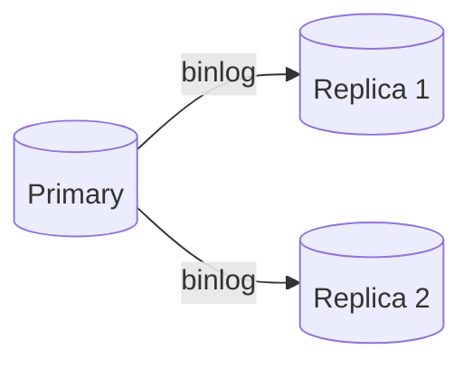

### From Fundamentals to MAANG Interview Mastery

> [!important] This document is designed to be **studied standalone**. Every topic MAANG interviewers probe — from basic SQL syntax to B+ Tree internals, MVCC, and sharding — is covered here with explanations of _why_, not just _how_.

---

# 1. Introduction

## What is SQL?

**SQL (Structured Query Language)** is a **declarative** language for defining, querying, and manipulating data in a relational database. "Declarative" means you specify _what_ result you want, not _how_ to compute it — the database engine figures out the "how."

## What is MySQL?

MySQL is an open-source **RDBMS** that implements SQL, with a **pluggable storage engine architecture** — the same SQL syntax can run against different underlying storage engines (InnoDB, MyISAM, Memory, etc.), each with different performance and durability characteristics.

## MySQL Architecture (High Level)

```
┌─────────────────────────────────────────────┐
│                  Client                       │
└───────────────────┬───────────────────────────┘
                    │  SQL over TCP/socket
┌───────────────────▼───────────────────────────┐
│  Connection Layer (auth, thread pooling)       │
├────────────────────────────────────────────────┤
│  SQL Layer                                      │
│   - Parser        (syntax → parse tree)         │
│   - Optimizer      (choose execution plan)      │
│   - Execution Engine (runs the plan)            │
├────────────────────────────────────────────────┤
│  Storage Engine API (pluggable: InnoDB/MyISAM)  │
├────────────────────────────────────────────────┤
│  Disk / Buffer Pool                             │
└──────────────────────────────────────────────────┘
```

## SQL Execution Flow — Step by Step

1. **Parsing** — SQL text is tokenized and validated for syntax; a parse tree is built.
2. **Semantic checks** — table/column existence and permissions are verified against the catalog.
3. **Query rewriting** — views are expanded, subqueries may be transformed.
4. **Optimization** — the optimizer evaluates candidate execution plans (which index to use, join order) using table statistics, and picks the lowest-cost plan.
5. **Execution** — the chosen plan is run against the storage engine, which fetches rows from the **buffer pool** (memory cache) or disk.
6. **Result return** — rows are streamed back to the client.

> [!tip] Interview Framing If asked "what happens when you run a query," always narrate this exact pipeline: **parse → validate → rewrite → optimize → execute → buffer pool/disk → return**.

### Key Interview Takeaways — Section 1

- MySQL separates the SQL layer from the storage engine layer — this pluggability is a defining architectural trait.
- Query execution always follows: parse → optimize → execute.
- The **buffer pool** (InnoDB's in-memory cache) is central to performance — most well-tuned reads never touch disk.

### Revision Summary — Section 1

- SQL = declarative query language; MySQL = RDBMS implementing SQL with pluggable engines.
- Architecture: Connection Layer → SQL Layer (parser, optimizer, executor) → Storage Engine → Disk.
- Query lifecycle: parse → validate → rewrite → optimize → execute → return.

---

# 2. MySQL Query Fundamentals

## SELECT

**Purpose:** Retrieve rows from one or more tables.

```sql
SELECT name, salary FROM employees;
```

- **Execution behavior:** Logically evaluated _after_ `FROM`, `WHERE`, `GROUP BY`, `HAVING` — even though it's written first.
- **Common mistake:** Assuming column order in output matches physical storage order — it doesn't; it matches the `SELECT` list.

## DISTINCT

```sql
SELECT DISTINCT department_id FROM employees;
```

- Removes duplicate rows from the result set **after** all columns in the SELECT list are considered together.
- **Performance:** Requires a sort or hash-based deduplication internally — can be costly on large, low-selectivity columns.

> [!warning] Common Mistake `SELECT DISTINCT col1, col2` deduplicates on the **combination** of both columns, not each independently.

## WHERE

```sql
SELECT * FROM employees WHERE department_id = 3 AND salary > 50000;
```

- Filters rows **before** grouping.
- **Sargable predicates** (able to use an index) vs. non-sargable (`WHERE YEAR(hire_date) = 2026` disables index use on `hire_date`).

## ORDER BY

```sql
SELECT name, salary FROM employees ORDER BY salary DESC, name ASC;
```

- If an index exists matching the `ORDER BY` columns (and direction), MySQL can avoid an expensive **filesort**.

## LIMIT / OFFSET

```sql
SELECT * FROM employees ORDER BY id LIMIT 10 OFFSET 20;
```

- **Performance pitfall:** Large `OFFSET` values are slow — MySQL still scans and discards all skipped rows. Prefer **keyset pagination** (`WHERE id > last_seen_id LIMIT 10`) for deep pagination.

## GROUP BY

```sql
SELECT department_id, AVG(salary) AS avg_salary
FROM employees
GROUP BY department_id;
```

- Groups rows sharing the same value(s); aggregate functions (`AVG`, `SUM`, `COUNT`) operate per group.
- Since MySQL 5.7 (with `ONLY_FULL_GROUP_BY` enabled by default in 5.7+), selecting a non-aggregated, non-grouped column throws an error — a very common "gotcha" for engineers coming from older MySQL versions.

## HAVING

```sql
SELECT department_id, AVG(salary) AS avg_salary
FROM employees
GROUP BY department_id
HAVING AVG(salary) > 70000;
```

- Filters **after** grouping/aggregation, unlike `WHERE` which filters rows before grouping.

### WHERE vs HAVING

|Aspect|WHERE|HAVING|
|---|---|---|
|Applied|Before grouping|After grouping/aggregation|
|Can use aggregate functions|No|Yes|
|Performance|Generally faster (filters early, can use indexes)|Operates on already-reduced group set|

## Alias

```sql
SELECT e.name AS employee_name, d.name AS dept_name
FROM employees AS e
JOIN departments AS d ON e.department_id = d.id;
```

- Improves readability; required for self-joins and derived tables.

## CASE

```sql
SELECT name,
  CASE
    WHEN salary >= 100000 THEN 'Senior'
    WHEN salary >= 60000 THEN 'Mid'
    ELSE 'Junior'
  END AS level
FROM employees;
```

## IF

```sql
SELECT name, IF(salary > 80000, 'High', 'Standard') AS pay_band FROM employees;
```

- `IF()` is MySQL-specific shorthand; `CASE` is ANSI-standard and preferred for portability and multi-branch logic.

## BETWEEN

```sql
SELECT * FROM employees WHERE salary BETWEEN 50000 AND 90000;
```

- Inclusive on both bounds. Equivalent to `salary >= 50000 AND salary <= 90000`.

## IN

```sql
SELECT * FROM employees WHERE department_id IN (1, 2, 5);
```

## EXISTS

```sql
SELECT * FROM departments d
WHERE EXISTS (SELECT 1 FROM employees e WHERE e.department_id = d.id);
```

- Short-circuits as soon as one matching row is found — often faster than `IN` with a large subquery result set.

## LIKE

```sql
SELECT * FROM employees WHERE name LIKE 'A%';
```

- `%` matches any sequence, `_` matches a single character.
- **Performance:** A leading `%` (`LIKE '%son'`) prevents standard B+ Tree index usage since prefixes can't be matched.

## REGEXP

```sql
SELECT * FROM employees WHERE name REGEXP '^A.*n$';
```

- More powerful than `LIKE` but **cannot use a standard index** — always results in a full scan unless combined with a sargable prefix filter.

## IS NULL

```sql
SELECT * FROM employees WHERE manager_id IS NULL;
```

> [!warning] Common Mistake `WHERE manager_id = NULL` **never** matches anything — comparisons with `NULL` always yield `NULL` (unknown), not `TRUE`. Always use `IS NULL` / `IS NOT NULL`.

## UNION / UNION ALL

```sql
SELECT name FROM current_employees
UNION
SELECT name FROM former_employees;
```

### UNION vs UNION ALL

|Aspect|UNION|UNION ALL|
|---|---|---|
|Duplicates|Removed (implicit `DISTINCT`)|Kept|
|Performance|Slower (dedup requires sort/hash)|Faster|
|Use when|You need a distinct combined set|You know there's no overlap, or duplicates are fine/desired|

## INTERSECT / EXCEPT (Conceptual — native since MySQL 8.0.31)

```sql
-- INTERSECT: rows in both sets
SELECT dept_id FROM current_projects
INTERSECT
SELECT dept_id FROM archived_projects;

-- EXCEPT: rows in first set but not second
SELECT dept_id FROM all_departments
EXCEPT
SELECT dept_id FROM departments_with_projects;
```

> [!important] Before MySQL 8.0.31, `INTERSECT`/`EXCEPT` had to be emulated using `JOIN`/`NOT EXISTS`. Interviewers may test whether you know this is version-dependent.

### Key Interview Takeaways — Section 2

- `WHERE` filters before grouping; `HAVING` filters after.
- Deep `OFFSET` pagination is an anti-pattern — use keyset pagination.
- Leading wildcards in `LIKE` and any `REGEXP` usage generally defeat index usage.
- `NULL` requires `IS NULL`, never `= NULL`.

### Revision Summary — Section 2

- Query clause logical order: `FROM → WHERE → GROUP BY → HAVING → SELECT → ORDER BY → LIMIT`.
- `UNION` dedups (slower); `UNION ALL` doesn't (faster).
- `EXISTS` short-circuits; often faster than `IN` for large subqueries.

---

# 3. SQL Categories

## DDL — Data Definition Language

```sql
CREATE TABLE products (
    id INT PRIMARY KEY AUTO_INCREMENT,
    name VARCHAR(100) NOT NULL,
    price DECIMAL(10,2)
);

ALTER TABLE products ADD COLUMN stock INT DEFAULT 0;
ALTER TABLE products MODIFY COLUMN price DECIMAL(12,2);
ALTER TABLE products RENAME COLUMN stock TO inventory;

DROP TABLE products;
TRUNCATE TABLE products;
RENAME TABLE products TO items;
```

- DDL statements in MySQL/InnoDB cause an **implicit commit** — you cannot roll back a `CREATE TABLE` inside a transaction.

## DML — Data Manipulation Language

```sql
INSERT INTO products (name, price) VALUES ('Widget', 9.99);
UPDATE products SET price = 12.99 WHERE id = 1;
DELETE FROM products WHERE id = 1;
REPLACE INTO products (id, name, price) VALUES (1, 'Widget', 11.99);
```

- `REPLACE` deletes the existing row (if a PK/unique conflict occurs) and inserts a new one — this **resets any columns not specified** to their defaults, and re-triggers `AUTO_INCREMENT` allocation. It is _not_ the same as `UPDATE`.

## DQL — Data Query Language

```sql
SELECT * FROM products WHERE price > 10;
```

## DCL — Data Control Language

```sql
GRANT SELECT, UPDATE ON company.products TO 'app_user'@'%';
REVOKE UPDATE ON company.products FROM 'app_user'@'%';
```

## TCL — Transaction Control Language

```sql
START TRANSACTION;
SAVEPOINT sp1;
UPDATE products SET price = price * 1.1;
ROLLBACK TO sp1;
COMMIT;

SET TRANSACTION ISOLATION LEVEL READ COMMITTED;
```

### SQL Category Comparison

|Category|Statements|Auto-commits?|Rollback-able?|
|---|---|---|---|
|DDL|CREATE, ALTER, DROP, TRUNCATE, RENAME|Yes (implicit commit)|No|
|DML|INSERT, UPDATE, DELETE, REPLACE|No (respects transaction)|Yes|
|DQL|SELECT|N/A|N/A|
|DCL|GRANT, REVOKE|Yes|No|
|TCL|COMMIT, ROLLBACK, SAVEPOINT, SET TRANSACTION|N/A|N/A|

### Key Interview Takeaways — Section 3

- DDL causes an implicit commit in MySQL — you cannot wrap schema changes and data changes in one rollback-able transaction.
- `REPLACE` = delete + insert, not an in-place update; watch for reset columns and new auto-increment values.

### Revision Summary — Section 3

- DDL defines structure (not rollback-able); DML manipulates data (rollback-able); DQL queries; DCL manages permissions; TCL controls transactions.

---

# 4. Data Types

|Category|Types|Storage Notes|Use Case|
|---|---|---|---|
|Numeric|`TINYINT` (1B), `SMALLINT` (2B), `INT` (4B), `BIGINT` (8B), `DECIMAL(p,s)`, `FLOAT`, `DOUBLE`|`DECIMAL` stores exact fixed-point values|Use `DECIMAL` for money; `INT`/`BIGINT` for IDs/counts|
|String|`CHAR(n)` (fixed), `VARCHAR(n)` (variable, +1-2 byte length prefix), `TEXT`/`MEDIUMTEXT`/`LONGTEXT`|`CHAR` padded with spaces; `VARCHAR` stores only actual length|`CHAR` for fixed-length codes (e.g., country codes); `VARCHAR` for names|
|Date/Time|`DATE`, `DATETIME` (8 bytes, no TZ), `TIMESTAMP` (4 bytes, UTC-based, range until 2038), `TIME`, `YEAR`|`TIMESTAMP` auto-converts to/from session timezone|Use `DATETIME` for events without timezone concerns; `TIMESTAMP` for audit columns needing TZ conversion|
|JSON|`JSON`|Stored as validated binary format (since 5.7)|Semi-structured/nested data; index via generated columns|
|ENUM|`ENUM('small','medium','large')`|Stored internally as integers|Small, fixed, rarely-changing value sets|
|SET|`SET('a','b','c')`|Bitmask storage, up to 64 members|Multiple flag-like values in one column|
|Spatial|`GEOMETRY`, `POINT`, `POLYGON`|Indexed via R-Tree (spatial index)|Geospatial queries (`ST_Distance_Sphere`, etc.)|

```sql
CREATE TABLE events (
    id INT PRIMARY KEY,
    metadata JSON,
    size ENUM('S','M','L'),
    tags SET('urgent','internal','flagged')
);

SELECT * FROM events WHERE JSON_EXTRACT(metadata, '$.status') = 'active';
```

> [!warning] Common Mistake Using `ENUM` for values expected to change frequently — adding a new value requires an `ALTER TABLE`, and removing one can silently truncate existing data to an empty string on strict-mode-off systems.

> [!tip] Interview Takeaway Be ready to justify `DECIMAL` over `FLOAT`/`DOUBLE` for money with a concrete example: `0.1 + 0.2` in floating point does not equal `0.3` exactly, due to binary floating-point representation — unacceptable for financial calculations.

### Key Interview Takeaways — Section 4

- `DECIMAL` for money, never `FLOAT`/`DOUBLE`.
- `TIMESTAMP` is timezone-aware and range-limited (until 2038); `DATETIME` is not.
- `ENUM` is efficient but inflexible for evolving value sets.

### Revision Summary — Section 4

- Choose numeric types by precision need; string types by length variability; date types by timezone/range needs; JSON for flexible nested data.

---

# 5. Constraints

```sql
CREATE TABLE accounts (
    id INT PRIMARY KEY AUTO_INCREMENT,
    email VARCHAR(255) UNIQUE NOT NULL,
    balance DECIMAL(12,2) NOT NULL DEFAULT 0.00 CHECK (balance >= 0),
    owner_id INT,
    FOREIGN KEY (owner_id) REFERENCES customers(id) ON DELETE CASCADE
);
```

|Constraint|Why It Exists|Internal Behavior|Performance Impact|
|---|---|---|---|
|`PRIMARY KEY`|Uniquely identifies each row|Becomes the clustered index in InnoDB — physically orders the table|Fast PK lookups; adds slight write overhead to maintain order|
|`FOREIGN KEY`|Enforces referential integrity across tables|Checked at INSERT/UPDATE/DELETE time; requires a matching index on the referenced column|Adds overhead on writes; enables cascading actions|
|`UNIQUE`|Prevents duplicate values|Creates a secondary index|Enforced via index lookup on every write|
|`CHECK`|Enforces domain/business rules at the DB level|Evaluated per row on INSERT/UPDATE (enforced since 8.0.16)|Minor CPU overhead, no index involved|
|`DEFAULT`|Supplies a value when none given|Applied at insert time if column omitted|Negligible|
|`NOT NULL`|Disallows missing values|Enforced at write time|Negligible, but enables better index/storage optimizations|

> [!tip] Interview Takeaway Constraints aren't just "validation" — they're also **performance signals** to the optimizer. A `NOT NULL` + `UNIQUE` column, for example, lets the optimizer make stronger assumptions during query planning.

### Key Interview Takeaways — Section 5

- `FOREIGN KEY` requires an index on the referencing column, or MySQL creates one automatically.
- `CHECK` constraints are only truly enforced from MySQL 8.0.16 onward — older versions silently parsed but ignored them.

### Revision Summary — Section 5

- Constraints enforce data integrity declaratively at the database layer, reducing reliance on application-level validation, and inform the optimizer.

---

# 6. Keys & Indexes

## Key Types

|Key Type|Definition|
|---|---|
|**Super Key**|Any set of columns that uniquely identifies a row (may include extra, redundant columns)|
|**Candidate Key**|A minimal super key — no redundant columns|
|**Primary Key**|The chosen candidate key used as the table's main identifier|
|**Alternate Key**|Candidate keys not chosen as primary (often enforced via `UNIQUE`)|
|**Composite Key**|A key made of multiple columns together|
|**Foreign Key**|A column referencing a primary/unique key in another table|

## Index Types

|Index Type|Description|Use Case|
|---|---|---|
|Clustered|Table data physically stored in this index's order (InnoDB PK)|Always exists — exactly one per table|
|Non-Clustered (Secondary)|Stores indexed column(s) + pointer to PK|Any column frequently filtered/sorted on|
|Composite|Index across multiple columns|Multi-column filters, following leftmost prefix rule|
|Covering|Index containing every column a query needs|Eliminates the secondary-index-to-clustered-index lookup|
|Prefix|Indexes only the first N characters of a string column|Long `VARCHAR`/`TEXT` columns|
|Unique|Enforces uniqueness + speeds lookups|Emails, usernames, SKUs|
|Full-Text|Inverted-index-like structure for text search|`MATCH ... AGAINST`|
|Spatial (R-Tree)|Indexes geometric data|Location-based queries|

```sql
CREATE INDEX idx_email_prefix ON customers (email(10));
CREATE FULLTEXT INDEX idx_body ON articles (body);
CREATE SPATIAL INDEX idx_location ON stores (location);
```

## B+ Trees

```
                [ 50 ]
              /        \
        [20, 35]       [70, 90]
        /  |  \          /  |  \
     leaf leaf leaf   leaf leaf leaf
      ↔     ↔     ↔     ↔    ↔    ↔   (leaf nodes linked for range scans)
```

- Internal nodes hold only routing keys; **all data lives in leaf nodes**, linked sequentially.
- Guarantees **O(log n)** search/insert/delete, and efficient **range scans** via leaf-link traversal.

## Hash Indexes

- Used by the `MEMORY` engine (and InnoDB's internal **Adaptive Hash Index**, an automatic optimization layer on top of B+ Trees).
- O(1) average lookup for **exact equality**, but **cannot support range queries** (`>`, `<`, `BETWEEN`) or sorting.

## Cardinality & Selectivity

- **Cardinality** — the number of distinct values in a column.
- **Selectivity** — cardinality relative to total row count; `selectivity = distinct_values / total_rows`.
- High-selectivity columns (e.g., `email`) make excellent index candidates; low-selectivity columns (e.g., `is_active` boolean) usually don't benefit much from indexing alone.

> [!important] The optimizer uses cardinality statistics to decide whether using an index is actually cheaper than a full table scan. On a low-selectivity column, MySQL may **ignore your index entirely** and scan the table instead — a frequent source of confusion.

## Leftmost Prefix Rule

```sql
CREATE INDEX idx_a_b_c ON t (a, b, c);
```

|Query|Can use idx_a_b_c?|
|---|---|
|`WHERE a = 1`|Yes|
|`WHERE a = 1 AND b = 2`|Yes|
|`WHERE a = 1 AND b = 2 AND c = 3`|Yes (full index usage)|
|`WHERE b = 2`|No|
|`WHERE b = 2 AND c = 3`|No|

## Index Merge

MySQL can sometimes combine **multiple single-column indexes** using union/intersection algorithms when no single composite index fits — visible in `EXPLAIN` as `Using union` / `Using intersect`. This is usually a signal that a proper composite index would perform better.

## Invisible Indexes (MySQL 8.0+)

```sql
ALTER TABLE employees ALTER INDEX idx_salary INVISIBLE;
```

- Lets you "soft-disable" an index (optimizer ignores it) without dropping it — a safe way to test whether an index is actually needed before permanently removing it.

### Clustered vs. Non-Clustered Index

|Aspect|Clustered|Non-Clustered|
|---|---|---|
|Data location|Table rows stored at leaf level|Leaf stores indexed value + PK pointer|
|Count per table|1 (InnoDB PK)|Many|
|Extra lookup needed?|No|Yes, unless covering|

### Composite vs. Covering Index

|Aspect|Composite Index|Covering Index|
|---|---|---|
|Definition|Index on multiple columns|Any index (single or composite) that contains **all** columns a query needs|
|Purpose|Support multi-column filters|Avoid the extra table lookup entirely|
|Relationship|A composite index _can be_ a covering index for a specific query|Not every composite index is covering for every query|

### Key Interview Takeaways — Section 6

- The **leftmost prefix rule** is one of the single most-tested MySQL concepts in interviews.
- Low-cardinality columns are poor standalone index candidates.
- Invisible indexes are the safe way to test index removal in production.

### Revision Summary — Section 6

- Keys: super → candidate → primary/alternate; indexes: clustered (1 per table) vs. secondary (many); B+ Trees back nearly all InnoDB indexes; hash indexes only support equality.

---

# 7. Joins

```sql
-- INNER JOIN
SELECT e.name, d.name FROM employees e INNER JOIN departments d ON e.department_id = d.id;

-- LEFT JOIN
SELECT e.name, d.name FROM employees e LEFT JOIN departments d ON e.department_id = d.id;

-- RIGHT JOIN
SELECT e.name, d.name FROM employees e RIGHT JOIN departments d ON e.department_id = d.id;

-- CROSS JOIN
SELECT c.color, s.size FROM colors c CROSS JOIN sizes s;

-- SELF JOIN
SELECT e1.name AS employee, e2.name AS manager
FROM employees e1 LEFT JOIN employees e2 ON e1.manager_id = e2.id;
```

```
INNER JOIN            LEFT JOIN              FULL OUTER (emulated)
  A ∩ B                  A ⊇ (A ∩ B)            A ∪ B
 ┌───┬───┐             ┌───┬───┐               ┌───┬───┐
 │ A │ B │             │ A │ B │               │ A │ B │
 └─┬─┴─┬─┘             └─┬─┴───┘               └─┬─┴─┬─┘
   └─┬─┘                 (all of A)             (all of both)
   match only
```

## Optimizer Behavior

- The optimizer chooses a **join algorithm**: **Nested Loop Join** (default, iterates outer table, looks up inner table per row — ideally via an index) or **Hash Join** (built-in since MySQL 8.0.18, used when no usable index exists on the join condition).
- **Join order matters**: the optimizer generally drives from the table it estimates will produce the fewest rows first, to minimize work in nested loops.
- An index on the join column of the **inner** table is critical — without one, each outer row triggers a full scan of the inner table.

> [!tip] Interview Takeaway Always mention: "For a nested loop join to be efficient, the inner table's join column must be indexed — otherwise it degrades toward O(n×m)."

### Key Interview Takeaways — Section 7

- MySQL has no native `FULL OUTER JOIN` — emulate via `UNION` of `LEFT` and `RIGHT` joins.
- Missing index on the join column of the inner table is the #1 cause of slow joins.

### Revision Summary — Section 7

- INNER = matches only; LEFT/RIGHT = all of one side + matches; CROSS = Cartesian product; SELF = table joined with itself, typically for hierarchies.

---

# 8. Subqueries

```sql
-- Scalar subquery
SELECT name, salary, (SELECT AVG(salary) FROM employees) AS company_avg
FROM employees;

-- Correlated subquery
SELECT name FROM employees e1
WHERE salary > (SELECT AVG(salary) FROM employees e2 WHERE e2.department_id = e1.department_id);

-- EXISTS
SELECT * FROM departments d WHERE EXISTS (SELECT 1 FROM employees e WHERE e.department_id = d.id);

-- NOT EXISTS
SELECT * FROM departments d WHERE NOT EXISTS (SELECT 1 FROM employees e WHERE e.department_id = d.id);

-- Derived table
SELECT dept_avg.department_id, dept_avg.avg_salary
FROM (SELECT department_id, AVG(salary) AS avg_salary FROM employees GROUP BY department_id) AS dept_avg
WHERE dept_avg.avg_salary > 70000;
```

- **Non-correlated subquery**: executed once, independent of the outer query.
- **Correlated subquery**: re-executed **once per outer row** — can be a major performance concern on large tables; MySQL 8.0's optimizer can sometimes rewrite correlated subqueries into semi-joins internally.

> [!tip] Optimization Tip Prefer rewriting correlated subqueries as `JOIN`s or window functions where possible — the optimizer can often produce a much better plan.

### Correlated vs. Non-Correlated Subquery

|Aspect|Non-Correlated|Correlated|
|---|---|---|
|Execution|Once|Once per outer row (logically)|
|Performance|Generally better|Can be expensive on large outer sets|
|Optimizer rewriting|N/A|Often internally rewritten to semi-join|

### Key Interview Takeaways — Section 8

- `EXISTS` short-circuits and is often faster than `IN` for large subquery result sets, especially with `NULL`s involved.
- Correlated subqueries are conceptually a loop — always ask "how many times does this re-run?"

### Revision Summary — Section 8

- Scalar returns one value; correlated depends on the outer query row; `EXISTS`/`NOT EXISTS` test existence efficiently; derived tables act as inline temporary result sets.

---

# 9. CTEs (Common Table Expressions)

```sql
WITH dept_avg AS (
    SELECT department_id, AVG(salary) AS avg_salary
    FROM employees GROUP BY department_id
)
SELECT e.name, e.salary, d.avg_salary
FROM employees e JOIN dept_avg d ON e.department_id = d.department_id;
```

```sql
-- Recursive CTE: org chart traversal
WITH RECURSIVE org_chart AS (
    SELECT id, name, manager_id, 1 AS depth
    FROM employees WHERE manager_id IS NULL
    UNION ALL
    SELECT e.id, e.name, e.manager_id, oc.depth + 1
    FROM employees e JOIN org_chart oc ON e.manager_id = oc.id
)
SELECT * FROM org_chart ORDER BY depth;
```

### CTE vs. Subquery

|Aspect|CTE|Subquery|
|---|---|---|
|Readability|Higher — named, top-down|Lower for deeply nested cases|
|Reusability within query|Can be referenced multiple times|Must be repeated or use a derived table|
|Recursion|Supported (`WITH RECURSIVE`)|Not supported|
|Materialization|May or may not be materialized — optimizer decides|Same|

### Key Interview Takeaways — Section 9

- CTEs are **not automatically faster** than subqueries — the main benefits are readability and recursion support.
- Recursive CTEs are the standard modern way to handle hierarchical data (org charts, category trees, bill-of-materials).

### Revision Summary — Section 9

- `WITH` defines a named, reusable result set; `WITH RECURSIVE` enables tree/graph traversal directly in SQL.

---

# 10. Views

```sql
CREATE VIEW high_earners AS
SELECT id, name, salary FROM employees WHERE salary > 100000;

CREATE VIEW updatable_dept_view AS
SELECT id, name FROM departments;

UPDATE updatable_dept_view SET name = 'Engineering' WHERE id = 1; -- works if the view is updatable
```

### View Types

|Type|Description|Updatable?|
|---|---|---|
|Normal View|Stored SELECT query, re-run each access|Sometimes|
|Updatable View|A view without joins/aggregates/DISTINCT/GROUP BY over a single table|Yes, with restrictions|
|Materialized View (concept)|A view whose results are physically stored/cached|**Not natively supported in MySQL** — emulate with a real table + scheduled refresh (event/cron)|

> [!warning] Common Mistake Believing MySQL views cache results. They don't — every access re-executes the underlying query (though the optimizer may merge/push down predicates for efficiency).

### Key Interview Takeaways — Section 10

- MySQL has no native materialized views — a frequent trick question versus Postgres/Oracle.
- A view is updatable only if MySQL can unambiguously map each output column back to exactly one underlying table column.

### Revision Summary — Section 10

- Views abstract and secure query logic; they are not a caching mechanism in MySQL.

---

# 11. Stored Procedures & Functions

```sql
DELIMITER //
CREATE PROCEDURE TransferFunds(
    IN from_id INT, IN to_id INT, IN amount DECIMAL(10,2), OUT success BOOLEAN
)
BEGIN
    DECLARE current_balance DECIMAL(10,2);

    DECLARE EXIT HANDLER FOR SQLEXCEPTION
    BEGIN
        ROLLBACK;
        SET success = FALSE;
    END;

    START TRANSACTION;
    SELECT balance INTO current_balance FROM accounts WHERE id = from_id FOR UPDATE;

    IF current_balance >= amount THEN
        UPDATE accounts SET balance = balance - amount WHERE id = from_id;
        UPDATE accounts SET balance = balance + amount WHERE id = to_id;
        COMMIT;
        SET success = TRUE;
    ELSE
        ROLLBACK;
        SET success = FALSE;
    END IF;
END //
DELIMITER ;

CALL TransferFunds(1, 2, 100.00, @result);
SELECT @result;
```

- **Parameters**: `IN` (input only), `OUT` (output only), `INOUT` (both).
- **Variables**: declared with `DECLARE`, session-scoped with `SET @var`.
- **Control flow**: `IF/ELSE`, `CASE`, `WHILE`, `REPEAT`, `LOOP`.
- **Error handling**: `DECLARE HANDLER` (`EXIT` or `CONTINUE`) for `SQLEXCEPTION`, `SQLWARNING`, or specific error conditions.

```sql
DELIMITER //
CREATE FUNCTION AnnualSalary(monthly DECIMAL(10,2)) RETURNS DECIMAL(10,2) DETERMINISTIC
BEGIN
    RETURN monthly * 12;
END //
DELIMITER ;
```

### Stored Procedure vs. Function

|Aspect|Procedure|Function|
|---|---|---|
|Callable from SELECT|No|Yes|
|Return value|Zero or more (via OUT params)|Exactly one|
|Can modify data|Yes|Discouraged/restricted for `DETERMINISTIC` functions|
|Transaction control|Yes (`START TRANSACTION`, `COMMIT`)|No|

### Key Interview Takeaways — Section 11

- Only functions can be used inline within a `SELECT`.
- `DETERMINISTIC` matters for replication/binary logging safety — non-deterministic functions with side effects can cause replica drift.

### Revision Summary — Section 11

- Procedures encapsulate multi-step logic + transactions; functions compute and return a single reusable value.

---

# 12. Triggers

```sql
CREATE TRIGGER before_employee_insert
BEFORE INSERT ON employees
FOR EACH ROW
BEGIN
    IF NEW.salary < 0 THEN
        SIGNAL SQLSTATE '45000' SET MESSAGE_TEXT = 'Salary cannot be negative';
    END IF;
END;

CREATE TRIGGER after_employee_update
AFTER UPDATE ON employees
FOR EACH ROW
BEGIN
    INSERT INTO employee_audit (employee_id, old_salary, new_salary, changed_at)
    VALUES (OLD.id, OLD.salary, NEW.salary, NOW());
END;
```

|Trigger Timing|Fires|Common Use|
|---|---|---|
|`BEFORE INSERT/UPDATE`|Before the row is written|Validation, auto-populating derived columns|
|`AFTER INSERT/UPDATE/DELETE`|After the row is written|Audit logging, cascading side effects|

### Benefits & Drawbacks

|Benefits|Drawbacks|
|---|---|
|Enforces rules centrally, regardless of client|Hides logic from application developers — harder to debug|
|Useful for audit trails|Can silently degrade write performance at scale|
|Guarantees consistency even for direct DB access|Chained triggers can cause hard-to-trace cascades|

### Key Interview Takeaways — Section 12

- Triggers are transactional — a trigger's changes roll back with the triggering statement.
- Overusing triggers for core business logic is a common anti-pattern flagged in interviews — prefer application-layer logic for anything complex.

### Revision Summary — Section 12

- BEFORE triggers validate/transform; AFTER triggers react (audit/cascade); use sparingly for cross-cutting concerns only.

---

# 13. Transactions

```sql
START TRANSACTION;

UPDATE accounts SET balance = balance - 500 WHERE id = 101; -- debit
UPDATE accounts SET balance = balance + 500 WHERE id = 202; -- credit

COMMIT;
```

## ACID in a Banking Context

|Property|Banking Example|
|---|---|
|Atomicity|Debit + credit both happen, or neither does — money never vanishes|
|Consistency|Total balance across all accounts remains constant before/after transfer|
|Isolation|A concurrent balance check by an auditor doesn't see a half-completed transfer|
|Durability|Once the customer sees "Transfer Successful," the change survives a server crash|

```sql
START TRANSACTION;
SAVEPOINT before_fee;
UPDATE accounts SET balance = balance - 5 WHERE id = 101; -- service fee
-- fee waived due to loyalty status
ROLLBACK TO before_fee;
COMMIT;
```

### Key Interview Takeaways — Section 13

- Always be ready to map each ACID letter to a concrete banking failure mode it prevents.
- `SAVEPOINT` allows partial rollback without abandoning the whole transaction.

### Revision Summary — Section 13

- `START TRANSACTION → ... → COMMIT/ROLLBACK`; `SAVEPOINT` for partial rollback; ACID guarantees are what make multi-statement operations safe.

---

# 14. Locking & Concurrency

## Lock Types

|Lock Type|Description|
|---|---|
|Shared (S) Lock|Multiple transactions can hold simultaneously; allows concurrent reads, blocks writes|
|Exclusive (X) Lock|Only one transaction can hold; blocks both reads (of the locked row, under certain modes) and writes|
|Row Lock|Locks a specific row (InnoDB default)|
|Table Lock|Locks the entire table (MyISAM default; InnoDB uses this for some DDL)|
|Gap Lock|Locks the "gap" between index records, preventing inserts within a range|
|Next-Key Lock|Combination of a row lock + gap lock on the preceding gap — InnoDB's default locking strategy under REPEATABLE READ|

```sql
-- Shared lock
SELECT * FROM accounts WHERE id = 1 LOCK IN SHARE MODE; -- (or FOR SHARE in 8.0+)

-- Exclusive lock
SELECT * FROM accounts WHERE id = 1 FOR UPDATE;
```

## Optimistic vs. Pessimistic Locking

|Aspect|Pessimistic|Optimistic|
|---|---|---|
|Assumption|Conflicts are likely|Conflicts are rare|
|Mechanism|Acquire lock before modifying|Compare version/timestamp at update time|
|Blocking|Yes, other transactions wait|No blocking; failed updates are retried|
|Best for|High contention (e.g., inventory decrement)|Low contention (e.g., user profile edits)|

```sql
-- Optimistic locking pattern
UPDATE inventory SET stock = stock - 1, version = version + 1
WHERE product_id = 42 AND version = 5;
-- If affected_rows = 0, someone else updated first -> retry
```

## Deadlocks

```
Transaction A: locks Row 1, waits for Row 2
Transaction B: locks Row 2, waits for Row 1
   → circular wait → InnoDB detects → rolls back the cheaper transaction
```

- **Detection**: InnoDB maintains a wait-for graph and detects cycles almost immediately.
- **Prevention**: acquire locks in a **consistent global order** (e.g., always lock lower ID first); keep transactions short; avoid unnecessary interactive/user-input-dependent steps inside a transaction.

### Row Lock vs. Table Lock

|Aspect|Row Lock|Table Lock|
|---|---|---|
|Granularity|Single row|Entire table|
|Concurrency|High|Low|
|Engine|InnoDB (default)|MyISAM (default); InnoDB for some DDL/bulk ops|
|Overhead|Higher per-lock bookkeeping|Lower overhead, but heavy contention|

### Key Interview Takeaways — Section 14

- Gap and next-key locks are InnoDB-specific mechanisms to prevent phantom reads under REPEATABLE READ — a frequently tested nuance.
- Deadlock prevention is about **consistent lock ordering**, not eliminating locks.

### Revision Summary — Section 14

- Shared vs. exclusive; row vs. table; gap/next-key locks close the phantom-read gap; optimistic locking trades blocking for retries.

---

# 15. Isolation Levels

|Level|Dirty Read|Non-Repeatable Read|Phantom Read|Notes|
|---|---|---|---|---|
|READ UNCOMMITTED|Possible|Possible|Possible|Rarely used; reads uncommitted data from other transactions|
|READ COMMITTED|Prevented|Possible|Possible|Each statement sees latest committed data|
|REPEATABLE READ (MySQL default)|Prevented|Prevented|Mostly prevented (gap locks)|Snapshot fixed at transaction start|
|SERIALIZABLE|Prevented|Prevented|Prevented|Effectively converts reads to locking reads|

### Definitions

- **Dirty Read**: reading uncommitted changes from another transaction that might later roll back.
- **Non-Repeatable Read**: re-reading the same row within a transaction returns different values because another transaction committed a change in between.
- **Phantom Read**: re-running the same range query within a transaction returns a different **set of rows** because another transaction inserted/deleted matching rows in between.

```sql
SET SESSION TRANSACTION ISOLATION LEVEL SERIALIZABLE;
START TRANSACTION;
SELECT * FROM accounts WHERE balance > 1000;
COMMIT;
```

### Repeatable Read vs. Serializable

|Aspect|REPEATABLE READ|SERIALIZABLE|
|---|---|---|
|Phantom read prevention|Mostly, via gap/next-key locks|Fully|
|Concurrency|Higher|Lower — heaviest locking|
|Default in MySQL?|Yes|No|
|Typical use|General-purpose default|High-integrity financial/audit workloads|

### Key Interview Takeaways — Section 15

- Know MySQL's default (**REPEATABLE READ**) and how it differs from most other RDBMS defaulting to READ COMMITTED.
- Be ready to give a one-line example for each anomaly (dirty/non-repeatable/phantom read).

### Revision Summary — Section 15

- Isolation levels trade concurrency for consistency guarantees; MySQL defaults to REPEATABLE READ, mitigating phantoms via gap locks (not purely via MVCC alone).

---

# 16. MVCC (Multi-Version Concurrency Control)

## Internal Working

- Every InnoDB row carries **hidden system columns**: a **transaction ID (`DB_TRX_ID`)** of the last modifying transaction, and a **roll pointer (`DB_ROLL_PTR`)** to the **undo log** entry holding the row's previous version.
- When a transaction reads a row, InnoDB walks the undo log chain (if needed) to reconstruct the version of the row that was visible **as of that transaction's snapshot**.

```
Row (current):  DB_TRX_ID=105 -> [ Row data v3 ]
                                        │ roll pointer
                                        ▼
Undo Log:                        [ Row data v2, trx=98 ]
                                        │
                                        ▼
                                  [ Row data v1, trx=50 ]
```

## Snapshot Reads vs. Consistent Reads

- **Consistent (snapshot) read**: a plain `SELECT` under REPEATABLE READ uses the snapshot taken at the transaction's first read — it never blocks and never sees other transactions' uncommitted or later-committed changes.
- **Locking read**: `SELECT ... FOR UPDATE` / `FOR SHARE` bypasses the snapshot and reads the **latest committed** version, acquiring a lock.

> [!important] MVCC is _why_ InnoDB readers generally don't block writers, and writers don't block readers — each transaction can operate against its own consistent view via undo logs, without needing to lock rows purely for reading.

### Key Interview Takeaways — Section 16

- MVCC relies on undo logs, not on copying entire tables — a common misconception is that MVCC "duplicates data," when really it retains prior _versions_ via chained undo records.
- `FOR UPDATE`/`FOR SHARE` reads bypass the snapshot and read the latest committed data with locking.

### Revision Summary — Section 16

- MVCC = snapshot-based concurrency via undo logs and transaction IDs; enables non-blocking consistent reads.

---

# 17. Query Optimization

```sql
EXPLAIN SELECT name FROM employees WHERE department_id = 3 ORDER BY salary DESC;
```

Example output (abridged):

```
+----+-------------+-----------+------+---------------+------+---------+
| id | select_type | table     | type | key           | rows | Extra   |
+----+-------------+-----------+------+---------------+------+---------+
|  1 | SIMPLE      | employees | ref  | idx_dept_sal  |  842 | NULL    |
+----+-------------+-----------+------+---------------+------+---------+
```

```sql
EXPLAIN ANALYZE SELECT name FROM employees WHERE department_id = 3 ORDER BY salary DESC;
```

`EXPLAIN ANALYZE` (8.0.18+) executes the query and shows **actual** timing/row counts alongside the estimated plan — far more reliable than `EXPLAIN` alone for diagnosing real performance.

## Key Concepts

- **Query Cost**: an internal, unitless estimate the optimizer uses to compare candidate plans — not a direct time measurement.
- **Execution Plan**: the concrete sequence of operations (table access order, join algorithm, index usage) chosen to run the query.
- **Predicate Pushdown**: filtering data as early as possible (closest to the storage engine) rather than after large joins/aggregations — reduces intermediate row counts.
- **Join Order**: the optimizer picks the order that (it estimates) processes the fewest rows overall; `STRAIGHT_JOIN` can force a specific order when the optimizer guesses wrong.
- **Covering Indexes**: see Section 6 — eliminates the extra clustered-index lookup.
- **Index Condition Pushdown (ICP)**: lets the storage engine evaluate part of a `WHERE` condition **using the index itself**, before fetching the full row — reduces unnecessary table reads. Visible as `Using index condition` in `EXPLAIN`.

```sql
-- Without ICP benefit: predicate must be checked after row fetch
-- With ICP: MySQL evaluates 'last_name LIKE 'Sm%'' using the index entries directly
CREATE INDEX idx_name ON employees (first_name, last_name);
SELECT * FROM employees WHERE first_name = 'John' AND last_name LIKE 'Sm%';
```

### Key Interview Takeaways — Section 17

- `EXPLAIN ANALYZE` gives real timings; plain `EXPLAIN` only gives estimates — know the difference.
- Index Condition Pushdown reduces I/O by filtering at the index level before touching full rows.

### Revision Summary — Section 17

- Use `EXPLAIN`/`EXPLAIN ANALYZE` to inspect plans; watch `type`, `key`, `rows`, `Extra`; push filters down early; ensure join order and indexes align with actual selectivity.

---

# 18. Performance Tuning

## Diagnosing Slow Queries

```sql
SET GLOBAL slow_query_log = 'ON';
SET GLOBAL long_query_time = 1; -- seconds
```

Or query the `performance_schema`/`sys` schema views for top time-consuming statements.

## Index Strategy

- Index columns used in `WHERE`, `JOIN ON`, `ORDER BY`, `GROUP BY`.
- Prefer composite indexes ordered by selectivity and query pattern (leftmost prefix rule).
- Periodically review unused indexes (`sys.schema_unused_indexes`) — every unused index is pure write overhead.

## Query Rewriting

```sql
-- Non-sargable (can't use index on created_at)
SELECT * FROM orders WHERE YEAR(created_at) = 2026;

-- Sargable rewrite
SELECT * FROM orders WHERE created_at >= '2026-01-01' AND created_at < '2027-01-01';
```

## Pagination Optimization

```sql
-- Slow for large offsets
SELECT * FROM products ORDER BY id LIMIT 10 OFFSET 100000;

-- Keyset pagination (fast, uses index)
SELECT * FROM products WHERE id > 100000 ORDER BY id LIMIT 10;
```

## Bulk Insert

```sql
-- Slow: one round trip per row
INSERT INTO logs (msg) VALUES ('a');
INSERT INTO logs (msg) VALUES ('b');

-- Fast: single batched statement
INSERT INTO logs (msg) VALUES ('a'), ('b'), ('c');
```

## Batch Updates

```sql
-- Update in chunks to avoid huge, long-held locks
UPDATE large_table SET status = 'archived'
WHERE status = 'pending' AND id BETWEEN 1 AND 10000;
-- repeat for next id range
```

## Avoiding N+1 Queries

```sql
-- N+1 anti-pattern (application loop)
-- for each order: SELECT * FROM order_items WHERE order_id = ?

-- Fix: single batched query
SELECT * FROM order_items WHERE order_id IN (1,2,3,4,5,...);
```

> [!warning] Common Mistake The N+1 problem is an application-layer pattern (common with ORMs), not a MySQL syntax issue — interviewers want you to recognize it in a code review context, not just define it.

### Key Interview Takeaways — Section 18

- Deep-offset pagination and N+1 query patterns are two of the most commonly flagged real-world performance anti-patterns in interviews.
- Batching writes reduces round-trip overhead dramatically.

### Revision Summary — Section 18

- Diagnose via slow query log/EXPLAIN; rewrite non-sargable predicates; batch inserts/updates; use keyset pagination; eliminate N+1 patterns.

---

# 19. Normalization

|Form|Requirement|
|---|---|
|1NF|Atomic values, no repeating groups/arrays in a column|
|2NF|1NF + no partial dependency of non-key attributes on part of a composite key|
|3NF|2NF + no transitive dependency (non-key attribute depends on another non-key attribute)|
|BCNF|3NF + every determinant is a candidate key (handles certain edge cases 3NF misses)|
|4NF|BCNF + no multi-valued dependencies|
|5NF|4NF + no join dependency that isn't implied by candidate keys (data can't be losslessly decomposed further)|

```sql
-- Violates 3NF: department_name is transitively dependent on department_id, not directly on employee id
-- employees(id, name, department_id, department_name)

-- 3NF-compliant:
CREATE TABLE departments (id INT PRIMARY KEY, name VARCHAR(100));
CREATE TABLE employees (id INT PRIMARY KEY, name VARCHAR(100), department_id INT REFERENCES departments(id));
```

## Denormalization Trade-offs

|Normalize When|Denormalize When|
|---|---|
|Write-heavy, integrity-critical (OLTP)|Read-heavy, join-expensive (reporting/analytics)|
|Data changes frequently|Data is mostly static/historical|
|Storage efficiency matters|Query latency matters more than storage cost|

> [!tip] Interview Takeaway In practice, most interviewers only expect **fluency through 3NF/BCNF** with a clear grasp of trade-offs — 4NF/5NF are rarely tested in depth but worth naming correctly if asked.

### Key Interview Takeaways — Section 19

- Normalization reduces redundancy and update anomalies; denormalization is a deliberate performance trade-off, not a mistake.

### Revision Summary — Section 19

- 1NF (atomicity) → 2NF (no partial dependency) → 3NF (no transitive dependency) → BCNF → 4NF/5NF (multi-valued/join dependencies); denormalize intentionally for read-heavy workloads.

---

# 20. Partitioning

```sql
-- RANGE
CREATE TABLE orders (
    id INT NOT NULL, order_date DATE NOT NULL, total DECIMAL(10,2)
)
PARTITION BY RANGE (YEAR(order_date)) (
    PARTITION p2024 VALUES LESS THAN (2025),
    PARTITION p2025 VALUES LESS THAN (2026),
    PARTITION p2026 VALUES LESS THAN (2027)
);

-- HASH
CREATE TABLE sessions (
    id BIGINT NOT NULL, user_id INT NOT NULL, data JSON
)
PARTITION BY HASH(user_id) PARTITIONS 8;

-- LIST
CREATE TABLE sales (
    id INT NOT NULL, region VARCHAR(20), amount DECIMAL(10,2)
)
PARTITION BY LIST COLUMNS(region) (
    PARTITION p_us VALUES IN ('US','CA'),
    PARTITION p_eu VALUES IN ('UK','DE','FR')
);

-- KEY (similar to HASH, uses MySQL's internal hashing function, supports multiple/non-integer columns)
CREATE TABLE user_data (
    id INT NOT NULL, region VARCHAR(20)
)
PARTITION BY KEY(id) PARTITIONS 4;
```

|Type|Use Case|
|---|---|
|RANGE|Time-series data — enables dropping old partitions instantly instead of slow DELETEs|
|HASH|Even distribution when there's no natural range/list grouping|
|LIST|Discrete categorical groupings (region, status)|
|KEY|Like HASH but MySQL manages the hashing function, supports more column types|

> [!important] Partitioning enables **partition pruning** — if a query's `WHERE` clause can be matched to specific partitions, MySQL skips scanning the rest entirely.

### Key Interview Takeaways — Section 20

- RANGE partitioning + dropping old partitions is a standard time-series data lifecycle pattern (much faster than bulk `DELETE`).
- Partitioning ≠ sharding — partitioning stays within one MySQL instance.

### Revision Summary — Section 20

- Choose RANGE for time-based data, HASH/KEY for even distribution, LIST for categorical splits; partition pruning is the main performance win.

---

# 21. Replication & Sharding

## Master-Replica Replication



- The primary logs all changes to the **binary log (binlog)**; replicas apply these changes to stay in sync.
- **Asynchronous** (default): fast, but replicas may lag.
- **Semi-synchronous**: primary waits for at least one replica ack before committing — safer, slightly slower.

## GTID (Global Transaction Identifiers)

- Each transaction gets a **globally unique ID**, simplifying replica failover and making it easy to track exactly which transactions a replica has applied — replacing the older, more fragile binlog-file-and-position-based replication tracking.

## Read Replicas

- Used to horizontally scale **read** throughput — route `SELECT`s to replicas, writes to the primary.
- Risk: **replication lag** can cause replicas to serve stale data.

## Sharding

|Type|Description|
|---|---|
|Horizontal Sharding|Split rows of the same table across multiple servers by a shard key (e.g., `user_id % N`)|
|Vertical Sharding|Split different tables/columns across servers (e.g., `users` on one DB, `orders` on another)|

### Pros & Cons

|Approach|Pros|Cons|
|---|---|---|
|Replication (read replicas)|Simple to set up, scales reads, provides failover|Doesn't scale writes; replication lag|
|Horizontal Sharding|Scales both reads and writes massively|Cross-shard joins/transactions become very hard; resharding is operationally painful|
|Vertical Sharding|Simple conceptually, isolates workloads|Doesn't solve single-table scale limits; cross-database joins impossible|

> [!warning] Common Mistake Reaching for sharding before exhausting simpler options (indexing, read replicas, caching, vertical scaling). Sharding is a last resort due to its operational complexity.

### Key Interview Takeaways — Section 21

- GTID-based replication is now the standard over legacy file+position replication for its simpler failover story.
- Horizontal sharding solves write scaling that replication alone cannot.

### Revision Summary — Section 21

- Replication scales reads and provides failover; sharding (horizontal/vertical) scales beyond a single server's write capacity, at the cost of cross-shard complexity.

---

# 22. CAP Theorem

- **Consistency** — every read receives the most recent write or an error.
- **Availability** — every request receives a (non-error) response, without guaranteeing it's the most recent write.
- **Partition Tolerance** — the system continues operating despite network partitions between nodes.

> [!important] CAP states you can only fully guarantee **two of the three** during an actual network partition. Partition tolerance is generally non-negotiable for any real distributed system, so the practical trade-off is really **Consistency vs. Availability** during a partition.

## Relating CAP to MySQL

- A **standalone MySQL instance** isn't a distributed system — CAP doesn't meaningfully apply to it.
- Once you add **replicas**, CAP trade-offs emerge:
    - **Asynchronous replication** → favors **Availability** (replicas keep serving reads even if stale during a partition).
    - **Synchronous/semi-synchronous replication with strict consistency requirements** → favors **Consistency** (writes may block or fail if an in-sync replica is unreachable).
- Distributed MySQL-compatible systems (e.g., Vitess, Aurora, Group Replication) make these CAP trade-offs explicit and configurable.

### Key Interview Takeaways — Section 22

- Only invoke CAP theorem when discussing **multi-node, replicated/distributed** MySQL deployments — not a single standalone instance.
- Frame the real-world trade-off as Consistency vs. Availability under partition, since partition tolerance is essentially mandatory.

### Revision Summary — Section 22

- CAP: pick 2 of 3 during a partition; in practice it's C vs. A; applies to replicated/distributed MySQL setups, not standalone instances.

---

# 23. Frequently Asked MAANG Interview Questions

> Each answer below is intentionally concise — practice extending each into a 30–60 second spoken explanation with a concrete example.

1. **What's the difference between InnoDB and MyISAM?** InnoDB: transactional, row-level locking, foreign keys, crash recovery via redo/undo logs. MyISAM: non-transactional, table-level locking, no foreign keys, faster for pure sequential reads with no concurrency. _Follow-up:_ "When would you still use MyISAM?" — rarely; maybe simple, append-only, single-writer archival tables. _Common mistake:_ Claiming MyISAM is "always faster" without qualifying the workload.
    
2. **What is a clustered index?** The index that determines the physical storage order of table rows; in InnoDB, it's always the primary key (or a hidden row ID if none exists). _Follow-up:_ "What happens if you don't define a primary key?" — InnoDB creates an invisible 6-byte `ROW_ID` clustered index internally.
    
3. **Explain the leftmost prefix rule.** A composite index `(a, b, c)` only serves queries filtering on a contiguous left-to-right prefix of its columns; skipping `a` makes the index unusable for `b`/`c` alone. _Common mistake:_ Assuming any subset of indexed columns can use the index.
    
4. **What is a covering index, and why does it matter?** An index containing every column a query needs, so MySQL never has to fetch the full row from the clustered index — visible as `Using index` in `EXPLAIN`. _Follow-up:_ "How would you verify a query is using a covering index?" — check `EXPLAIN`'s `Extra` column.
    
5. **What's the difference between `WHERE` and `HAVING`?** `WHERE` filters rows before grouping and can't use aggregates; `HAVING` filters after grouping and can use aggregate functions.
    
6. **Why is `SELECT *` discouraged?** Prevents covering-index optimization, transfers unnecessary data over the network, and is fragile to schema changes (column order/additions).
    
7. **What's the default isolation level in MySQL, and what does it prevent?** REPEATABLE READ — prevents dirty reads and non-repeatable reads, and mostly prevents phantom reads via gap/next-key locks. _Follow-up:_ "How does it differ from Postgres's default?" — Postgres defaults to READ COMMITTED.
    
8. **Explain MVCC.** InnoDB gives each transaction a consistent snapshot via undo logs and hidden transaction-ID columns, so readers see a point-in-time version of data without blocking writers.
    
9. **What causes a deadlock, and how does InnoDB resolve it?** Two transactions holding locks the other needs, forming a circular wait; InnoDB's detector identifies the cycle and rolls back the cheaper transaction automatically. _Follow-up:_ "How would you prevent deadlocks in application code?" — consistent lock/update ordering, shorter transactions.
    
10. **Optimistic vs. pessimistic locking — how do you choose?** Pessimistic (`FOR UPDATE`) for high-contention writes where conflicts are likely; optimistic (version columns) for low-contention scenarios where retries are cheap.
    
11. **What's the difference between `DELETE`, `TRUNCATE`, and `DROP`?** `DELETE` is row-by-row DML, filterable, rollback-able, fires triggers; `TRUNCATE` deallocates all data pages at once, resets auto-increment, doesn't fire triggers; `DROP` removes the entire table definition and data.
    
12. **What's a gap lock, and when is it used?** A lock on the range _between_ index entries, used under REPEATABLE READ to prevent other transactions from inserting rows into a locked range — closing the phantom-read gap.
    
13. **Why might an index not be used even though it exists?** Low selectivity (optimizer estimates a full scan is cheaper), a function wrapping the indexed column (non-sargable predicate), a leading wildcard in `LIKE`, or implicit type conversion.
    
14. **What's the difference between horizontal and vertical scaling for MySQL?** Vertical scaling = bigger single server (more CPU/RAM); horizontal scaling = distributing load across multiple servers (replicas for reads, shards for reads+writes).
    
15. **Partitioning vs. sharding — what's the difference?** Partitioning splits a table into sub-tables within one MySQL instance; sharding distributes data across multiple independent instances/servers.
    
16. **What is replication lag, and how does it affect application design?** The delay between a write on the primary and its application on a replica; can cause stale reads — mitigate via reading critical data from the primary, or using synchronous/semi-synchronous replication.
    
17. **What's the difference between a B+ Tree and a hash index?** B+ Trees support range queries and sorting via linked, ordered leaf nodes with O(log n) operations; hash indexes support only O(1) exact-match lookups, no ranges/sorting.
    
18. **How would you design a schema to avoid the N+1 query problem?** Use joins or batched `IN (...)` queries instead of looping per-parent-row queries in application code; consider eager-loading strategies in the ORM.
    
19. **What is index condition pushdown?** An optimization where part of the `WHERE` clause is evaluated using index entries directly, before fetching full rows from the table, reducing unnecessary I/O.
    
20. **Explain the difference between `IN` and `EXISTS`.** `IN` materializes/compares against a list of subquery results; `EXISTS` checks for row existence and short-circuits on the first match — often faster for correlated checks, especially with large or NULL-containing subquery results.
    
21. **What's a phantom read, and how does MySQL prevent it?** Re-running a range query within a transaction returns a different row set due to concurrent inserts/deletes; InnoDB's REPEATABLE READ largely prevents this via gap/next-key locks.
    
22. **When would you denormalize a schema?** For read-heavy/reporting workloads where join costs outweigh the redundancy/update-anomaly risk — a deliberate performance trade-off, not a design flaw.
    
23. **What is the purpose of `AUTO_INCREMENT`, and what are its pitfalls?** Auto-generates unique sequential IDs; pitfalls include gaps from rolled-back transactions/restarts, and it should never be assumed strictly gapless or ordered under concurrent inserts.
    
24. **How does MySQL handle `NULL` in comparisons and aggregates?** Any comparison with `NULL` (except `IS NULL`/`IS NOT NULL`) yields `NULL` (unknown); aggregate functions like `COUNT(column)` ignore `NULL`s, while `COUNT(*)` counts all rows.
    
25. **What's the difference between `CHAR` and `VARCHAR`?** `CHAR` is fixed-length (space-padded, faster for uniform-length data); `VARCHAR` is variable-length with a small length prefix, more storage-efficient for variable data.
    
26. **How do you design for high write throughput?** Minimize secondary indexes on hot write tables, batch inserts, consider partitioning/sharding, tune the InnoDB buffer pool and log file sizes, and evaluate write-optimized patterns (e.g., append-only tables).
    
27. **What is a semi-join, and how does it relate to `EXISTS`/`IN`?** An internal optimization where the optimizer transforms certain `IN`/`EXISTS` subqueries into a join-like operation that returns each outer row at most once, without materializing the full Cartesian product.
    
28. **Explain read-your-writes consistency in a replicated MySQL setup.** A guarantee that a client sees its own just-committed write immediately; hard to guarantee with asynchronous replicas — usually solved by routing the immediately-following read to the primary.
    
29. **What's the difference between `UNION` and `UNION ALL` performance-wise?** `UNION` deduplicates via an implicit sort/hash step (slower); `UNION ALL` simply concatenates result sets (faster) — use `UNION ALL` whenever duplicates are impossible or acceptable.
    
30. **How would you paginate a table with 100 million rows efficiently?** Avoid large `OFFSET`; use keyset/cursor-based pagination (`WHERE id > last_id ORDER BY id LIMIT n`), backed by an index on the ordering column.
    
31. **What is a composite primary key, and when would you use one?** A primary key spanning multiple columns, common in many-to-many join tables (e.g., `(user_id, role_id)`) where the combination is naturally unique.
    
32. **Explain the difference between `FOR UPDATE` and `LOCK IN SHARE MODE` (`FOR SHARE`).** `FOR UPDATE` acquires an exclusive lock (blocks other reads-for-update and writes); `FOR SHARE` acquires a shared lock (allows other shared locks, blocks exclusive locks/writes).
    
33. **What happens to foreign key constraints when you shard a database?** They generally can't be enforced across shard boundaries by the database — referential integrity must be enforced at the application layer instead.
    
34. **What's the difference between `TIMESTAMP` and `DATETIME`?** `TIMESTAMP` is stored in UTC, auto-converted to/from the session timezone, and limited to the range 1970–2038; `DATETIME` stores the literal value with no timezone conversion and a much wider range.
    
35. **How does the query optimizer decide join order?** It estimates the cost of different orderings using table statistics (row counts, index selectivity) and picks the order minimizing estimated total rows processed; `STRAIGHT_JOIN` can override this manually.
    
36. **What is an adaptive hash index?** An automatic InnoDB optimization that builds an in-memory hash index over frequently accessed B+ Tree pages to speed up equality lookups — transparent to the user, can be disabled if it causes contention.
    
37. **Explain the difference between a scalar subquery and a derived table.** A scalar subquery returns exactly one value used inline in an expression; a derived table is a subquery used as a virtual table in the `FROM` clause, returning multiple rows/columns.
    
38. **What's the risk of using `ORDER BY RAND()` for random row selection?** It forces MySQL to compute a random value for and sort _every_ row in the table — extremely inefficient at scale; better to use offset-based or ID-based random sampling techniques.
    
39. **How would you detect and fix a missing index causing a slow query?** Run `EXPLAIN`, look for `type: ALL` (full scan) or high `rows` estimates, identify the filter/join/sort columns involved, and add an appropriate (often composite) index; verify improvement with `EXPLAIN ANALYZE`.
    
40. **What's the difference between `INSERT ... ON DUPLICATE KEY UPDATE` and `REPLACE`?** `ON DUPLICATE KEY UPDATE` updates only the specified columns on conflict, preserving other existing column values; `REPLACE` deletes the whole conflicting row and reinserts it, resetting unspecified columns to defaults.
    
41. **What is a self-referencing foreign key, and give a use case.** A foreign key referencing the same table's primary key, e.g., `employees.manager_id REFERENCES employees.id` — used for hierarchical relationships.
    
42. **How does MySQL enforce uniqueness efficiently?** Via a `UNIQUE` index — every insert/update checks the index for a conflicting value before committing, using the same B+ Tree lookup structure as other indexes.
    
43. **What's the impact of a very wide table (many columns) on performance?** Larger row size means fewer rows fit per page, increasing I/O for full scans and reducing buffer pool efficiency; consider splitting rarely-accessed columns into a separate table (vertical partitioning).
    
44. **Explain the concept of "sargable" predicates.** "Search ARGument ABLE" — a predicate written so the database can use an index to evaluate it directly (e.g., `col = 5`), as opposed to predicates wrapped in functions/expressions that prevent index usage (e.g., `UPPER(col) = 'X'`).
    
45. **What's the difference between a temporary table and a derived table?** A temporary table (`CREATE TEMPORARY TABLE`) is explicitly created, session-scoped, and can be indexed/reused across multiple statements; a derived table is an inline subquery in `FROM`, scoped to a single query.
    
46. **How do you handle schema migrations on a large production MySQL table with minimal downtime?** Use online DDL (`ALGORITHM=INPLACE`) where supported, or tools like `gh-ost`/`pt-online-schema-change` that perform the migration via shadow tables and binlog-based synchronization to avoid long locks.
    
47. **What is the purpose of the InnoDB buffer pool, and how does its size affect performance?** An in-memory cache of data/index pages; a larger buffer pool (sized appropriately relative to dataset size) means more reads are served from memory instead of disk, dramatically improving throughput.
    
48. **How would you design a rate limiter using MySQL?** A table keyed by `(user_id, window_start)` with an atomic `INSERT ... ON DUPLICATE KEY UPDATE count = count + 1`, checked against a threshold — though a dedicated store like Redis is usually preferred for true low-latency rate limiting.
    
49. **What's a common cause of replication lag, and how would you mitigate it?** Single-threaded replication applying a high write volume from the primary faster than one thread can replay; mitigate with multi-threaded (parallel) replication, reducing large transactions, or scaling write load down via sharding.
    
50. **How would you explain database indexing to a non-technical stakeholder?** Compare it to a book's index — instead of reading every page (row) to find a topic, you look it up in the index and jump directly to the right page, at the cost of maintaining that index whenever the book's content changes.
    

### Key Interview Takeaways — Section 23

- Interviewers consistently probe **why**, not just definitions — always be ready with a mechanism (undo log, gap lock, B+ Tree) behind any concept you name.
- Follow-up questions almost always push toward trade-offs and production edge cases — practice extending each answer with "when would this NOT be the right choice?"

### Revision Summary — Section 23

- 50 questions span fundamentals, indexing, locking/isolation, optimization, and distributed concepts — the recurring theme across nearly all of them is **trade-offs grounded in internals**.

---

# 24. Comparison Tables

### DELETE vs TRUNCATE vs DROP

|Aspect|DELETE|TRUNCATE|DROP|
|---|---|---|---|
|Type|DML|DDL|DDL|
|Filterable (WHERE)|Yes|No|No|
|Rollback-able|Yes|Limited|Limited|
|Fires triggers|Yes|No|No|
|Resets AUTO_INCREMENT|No|Yes|N/A|

### WHERE vs HAVING

|Aspect|WHERE|HAVING|
|---|---|---|
|Applied|Before grouping|After grouping|
|Aggregate functions|Not allowed|Allowed|

### UNION vs UNION ALL

|Aspect|UNION|UNION ALL|
|---|---|---|
|Duplicates|Removed|Kept|
|Performance|Slower|Faster|

### CHAR vs VARCHAR

|Aspect|CHAR|VARCHAR|
|---|---|---|
|Length|Fixed|Variable|
|Storage|Padded with spaces|Length prefix + actual data|
|Best for|Fixed-length codes|Variable-length text|

### Primary Key vs Unique Key

|Aspect|Primary Key|Unique Key|
|---|---|---|
|NULLs|Not allowed|Allowed (one or more)|
|Count per table|One|Multiple|
|Index type|Clustered (InnoDB)|Secondary|

### Clustered vs Non-Clustered Index

|Aspect|Clustered|Non-Clustered|
|---|---|---|
|Storage|Table data at leaf level|Pointer to PK at leaf level|
|Count per table|One|Many|

### View vs CTE

|Aspect|View|CTE|
|---|---|---|
|Persistence|Stored in schema, reusable across queries|Scoped to a single query|
|Recursion|Not supported|Supported (`WITH RECURSIVE`)|

### Procedure vs Function

|Aspect|Procedure|Function|
|---|---|---|
|Used in SELECT|No|Yes|
|Return values|Zero+ (OUT params)|Exactly one|

### EXISTS vs IN

|Aspect|EXISTS|IN|
|---|---|---|
|Evaluation|Short-circuits on first match|Compares against full result list|
|NULL handling|Not affected by NULLs in subquery|`NOT IN` can behave unexpectedly with NULLs|

### JOIN vs Subquery

|Aspect|JOIN|Subquery|
|---|---|---|
|Result shape|Combines columns from multiple tables|Often used to filter/compute a single value or list|
|Optimizer flexibility|Generally more optimizable|Correlated subqueries can be harder to optimize|

### Row Lock vs Table Lock

|Aspect|Row Lock|Table Lock|
|---|---|---|
|Granularity|Single row|Whole table|
|Concurrency|High|Low|

### Optimistic vs Pessimistic Locking

|Aspect|Optimistic|Pessimistic|
|---|---|---|
|Approach|Version check at write time|Lock acquired before modification|
|Best for|Low contention|High contention|

### Correlated vs Non-Correlated Subquery

|Aspect|Correlated|Non-Correlated|
|---|---|---|
|Execution|Once per outer row|Once total|
|Performance|Can be expensive|Generally cheaper|

### Repeatable Read vs Serializable

|Aspect|REPEATABLE READ|SERIALIZABLE|
|---|---|---|
|Phantom reads|Mostly prevented (gap locks)|Fully prevented|
|Concurrency|Higher|Lower|

### Composite vs Covering Index

|Aspect|Composite Index|Covering Index|
|---|---|---|
|Definition|Index on multiple columns|Any index containing all columns a query needs|
|Goal|Support multi-column filters|Avoid table lookup entirely|

---

# 25. Cheat Sheet

## Syntax Summary

```sql
-- Core query skeleton
SELECT columns FROM table
WHERE condition
GROUP BY columns
HAVING condition
ORDER BY columns
LIMIT n OFFSET m;

-- Transaction skeleton
START TRANSACTION;
  ...statements...
COMMIT; -- or ROLLBACK;
```

## Index Rules

- Leftmost prefix rule governs composite index usability.
- High-selectivity columns benefit most from indexing.
- Covering indexes eliminate the secondary→clustered lookup.
- Functions/wildcards on indexed columns often disable index usage.

## Join Rules

- INNER = matches only; LEFT/RIGHT = all of one side + matches.
- Always index the join column on the inner/probed table.
- No native FULL OUTER JOIN — emulate with `UNION` of LEFT + RIGHT.

## Optimization Checklist

1. Run `EXPLAIN` / `EXPLAIN ANALYZE`.
2. Check `type` (avoid `ALL`), `key` (index used), `rows`, `Extra`.
3. Rewrite non-sargable predicates.
4. Add composite/covering indexes where justified.
5. Avoid deep `OFFSET`; use keyset pagination.
6. Batch inserts/updates; avoid N+1 patterns.

## Isolation Level Summary

|Level|Prevents|
|---|---|
|READ UNCOMMITTED|Nothing|
|READ COMMITTED|Dirty reads|
|REPEATABLE READ (default)|Dirty + non-repeatable reads, mostly phantoms|
|SERIALIZABLE|All three anomalies|

## Transaction Flow

```
START TRANSACTION
   → SAVEPOINT (optional)
   → DML statements
   → COMMIT (persist) or ROLLBACK (undo)
```

## Common Interview One-Liners

- "MySQL's default isolation level is REPEATABLE READ, using MVCC plus gap/next-key locks to largely prevent phantom reads."
- "InnoDB's primary key is the clustered index — it physically determines row storage order."
- "A covering index lets MySQL answer a query using only the index, skipping the table lookup entirely."
- "Partitioning splits a table within one server; sharding distributes data across multiple servers."
- "DECIMAL for money, never FLOAT/DOUBLE, because binary floating point can't represent all decimal fractions exactly."
- "The leftmost prefix rule means a composite index (a,b,c) only helps queries filtering on a contiguous prefix starting at a."

---

# Related Notes

- [[What is DBMS]]
- [[DBMS vs File System]]
- [[Types of Databases]]
- [[MySQL]]
- [[RDBMS]]
- [[ACID]]
- [[Transactions]]
- [[Indexes]]
- [[Normalization]]
- [[Concurrency Control]]
- [[CAP Theorem]]
- [[Storage Engine]]
- [[SQL]]