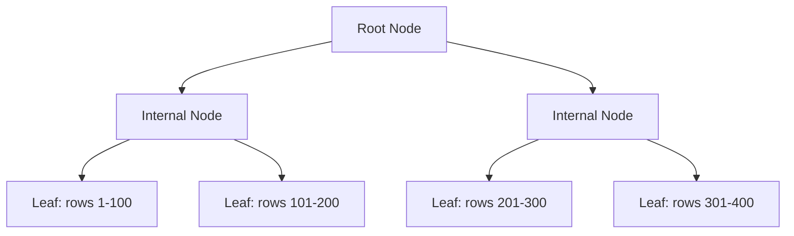
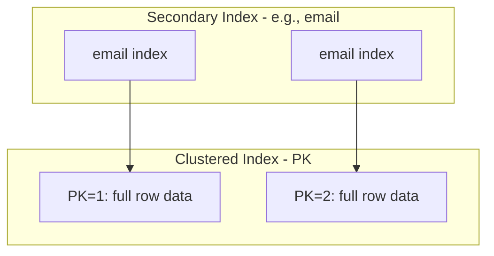
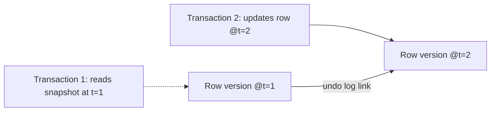
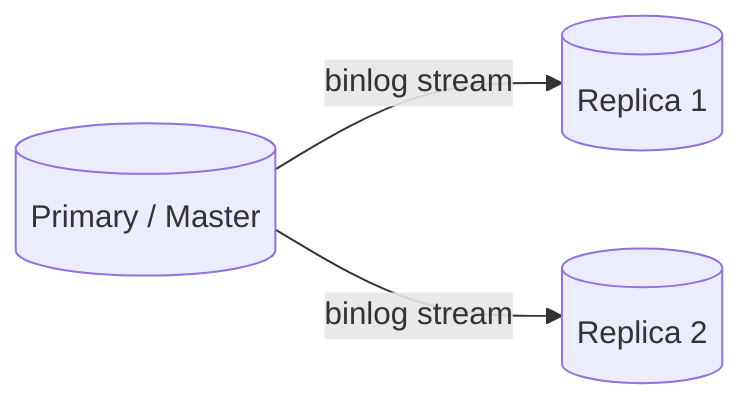

> [!important] MySQL is an open-source **Relational Database Management System (RDBMS)** built on SQL, widely used in production at web-scale companies. This note covers MySQL from fundamentals through the advanced internals (B+ Trees, MVCC, locking, sharding) that MAANG interviewers probe for in both SQL/DBMS-fundamentals rounds and system design rounds.

---

## Table of Contents

1. MySQL Fundamentals & Architecture
2. Storage Engines: InnoDB vs. MyISAM
3. ACID Properties
4. SQL Command Categories (DDL, DML, DCL, TCL, DQL)
5. Data Types
6. Constraints & Keys
7. Indexes Deep Dive
8. Normalization
9. Joins
10. Subqueries & CTEs
11. Views
12. Stored Procedures & Functions
13. Triggers
14. Transactions
15. Locking, Deadlocks & MVCC
16. Isolation Levels
17. Query Optimization & Execution Plans
18. Indexing Strategies
19. Sharding, Replication & Partitioning
20. CAP Theorem Relevance
21. Interview Questions
22. Common Mistakes & Edge Cases
23. Final Revision Summary

---

# 1. MySQL Fundamentals & Architecture

MySQL follows a **client-server architecture**:


### Layers

|Layer|Responsibility|
|---|---|
|Connection Layer|Authentication, connection pooling, thread management|
|SQL Layer|Parsing, query rewriting, optimization, caching (query cache removed in MySQL 8.0)|
|Storage Engine Layer|Pluggable engines (InnoDB, MyISAM, Memory, etc.) handling actual data storage/retrieval|

> [!important] MySQL's **pluggable storage engine architecture** is a defining feature — the SQL layer is engine-agnostic; you can `ALTER TABLE t ENGINE=InnoDB` to switch engines without changing your SQL.

> [!tip] Interview Takeaway Be ready to explain that MySQL separates the **SQL/query processing layer** from the **storage engine layer** — this is a common "explain the architecture" opener question.

---

# 2. Storage Engines: InnoDB vs. MyISAM

|Feature|InnoDB|MyISAM|
|---|---|---|
|Transactions|Yes (full ACID)|No|
|Foreign Keys|Yes|No|
|Locking granularity|Row-level|Table-level|
|Crash recovery|Yes (WAL / redo log)|Limited, prone to corruption|
|MVCC|Yes|No|
|Full-text search|Yes (since 5.6)|Yes (historically better)|
|Storage|Clustered index (data stored with PK)|Data and index stored separately|
|Default engine|Yes (since MySQL 5.5)|No (legacy)|
|Best for|OLTP, transactional workloads|Read-heavy, legacy, simple reporting tables|

> [!warning] Common Mistake Assuming MyISAM is "faster" universally. MyISAM can be faster for pure sequential reads with no concurrent writes, but InnoDB dominates in virtually every real-world concurrent, transactional workload due to row-level locking and crash recovery.

### Interview Takeaway

> [!tip] Always default to recommending **InnoDB** unless given a specific reason (e.g., legacy full-text search needs pre-5.6, or a pure append-only archival table with no concurrency). Interviewers want you to justify the choice, not just name it.

---

# 3. ACID Properties

|Property|Meaning|MySQL/InnoDB Mechanism|
|---|---|---|
|**Atomicity**|All operations in a transaction succeed or none do|Undo logs roll back incomplete transactions|
|**Consistency**|Data moves from one valid state to another|Constraints (FK, CHECK, UNIQUE) + application logic|
|**Isolation**|Concurrent transactions don't interfere incorrectly|Locking + MVCC, controlled via isolation levels|
|**Durability**|Committed data survives crashes|Redo log (write-ahead logging) flushed to disk|

```sql
START TRANSACTION;
UPDATE accounts SET balance = balance - 100 WHERE id = 1;
UPDATE accounts SET balance = balance + 100 WHERE id = 2;
COMMIT;
```

If the process crashes between the two `UPDATE`s, InnoDB's undo log ensures the transaction is fully rolled back on recovery — atomicity is preserved.

> [!tip] Interview Takeaway Know how each ACID property maps to a _specific mechanism_ (undo log for atomicity, redo log for durability). Naming the mechanism, not just the property, signals depth.

---

# 4. SQL Command Categories

## DDL (Data Definition Language)

Defines/modifies schema structure.

```sql
CREATE TABLE employees (
    id INT PRIMARY KEY AUTO_INCREMENT,
    name VARCHAR(100) NOT NULL,
    department_id INT,
    salary DECIMAL(10,2)
);

ALTER TABLE employees ADD COLUMN hire_date DATE;

DROP TABLE employees;

TRUNCATE TABLE employees;
```

## DML (Data Manipulation Language)

Modifies data.

```sql
INSERT INTO employees (name, department_id, salary) VALUES ('Alice', 1, 75000);
UPDATE employees SET salary = salary * 1.1 WHERE department_id = 1;
DELETE FROM employees WHERE id = 5;
```

## DCL (Data Control Language)

Manages permissions.

```sql
GRANT SELECT, INSERT ON company.employees TO 'analyst'@'%';
REVOKE INSERT ON company.employees FROM 'analyst'@'%';
```

## TCL (Transaction Control Language)

Manages transactions.

```sql
START TRANSACTION;
SAVEPOINT before_update;
UPDATE employees SET salary = 0 WHERE id = 5;
ROLLBACK TO before_update;
COMMIT;
```

## DQL (Data Query Language)

Retrieves data.

```sql
SELECT name, salary
FROM employees
WHERE department_id = 1
ORDER BY salary DESC
LIMIT 10;
```

### DELETE vs. TRUNCATE vs. DROP

|Aspect|DELETE|TRUNCATE|DROP|
|---|---|---|---|
|Type|DML|DDL|DDL|
|Removes|Rows (optionally filtered via WHERE)|All rows|Entire table structure + data|
|Rollback|Yes (transactional, logged row-by-row)|Limited (implicit commit in MySQL)|Limited (implicit commit)|
|Triggers fired|Yes|No|No|
|Resets AUTO_INCREMENT|No|Yes|N/A (table gone)|
|Speed|Slower (row-by-row logging)|Fast (deallocates pages)|Fast|

> [!tip] Interview Takeaway `DELETE` is a logged, row-by-row DML operation (can use `WHERE`, fires triggers, transactional); `TRUNCATE` is a DDL-like operation that deallocates the whole table's data pages at once and resets `AUTO_INCREMENT`; `DROP` removes the table definition entirely.

---

# 5. Data Types

|Category|Types|Notes|
|---|---|---|
|Numeric|`TINYINT`, `INT`, `BIGINT`, `DECIMAL`, `FLOAT`, `DOUBLE`|Use `DECIMAL` for money — exact precision, unlike `FLOAT`/`DOUBLE`|
|String|`CHAR`, `VARCHAR`, `TEXT`, `ENUM`, `SET`|`CHAR` fixed-length (padded), `VARCHAR` variable-length|
|Date/Time|`DATE`, `DATETIME`, `TIMESTAMP`, `TIME`, `YEAR`|`TIMESTAMP` is timezone-aware and range-limited (until 2038); `DATETIME` is not|
|Binary|`BLOB`, `VARBINARY`|For binary data; avoid storing large files directly — prefer references to object storage|
|JSON|`JSON`|Native JSON type since MySQL 5.7, supports indexing via generated columns|

> [!warning] Common Mistake Using `FLOAT`/`DOUBLE` for currency. Floating-point types introduce rounding errors — always use `DECIMAL(p,s)` for monetary values.

---

# 6. Constraints & Keys

```sql
CREATE TABLE orders (
    id INT PRIMARY KEY AUTO_INCREMENT,
    customer_id INT NOT NULL,
    order_total DECIMAL(10,2) CHECK (order_total >= 0),
    status VARCHAR(20) DEFAULT 'pending',
    tracking_code VARCHAR(50) UNIQUE,
    FOREIGN KEY (customer_id) REFERENCES customers(id)
        ON DELETE CASCADE
        ON UPDATE CASCADE
);
```

|Constraint|Purpose|
|---|---|
|`PRIMARY KEY`|Uniquely identifies each row; implicitly `NOT NULL` + `UNIQUE`; creates a clustered index in InnoDB|
|`FOREIGN KEY`|Enforces referential integrity between tables|
|`UNIQUE`|Ensures no duplicate values in a column (creates a secondary index)|
|`NOT NULL`|Disallows NULL values|
|`CHECK`|Enforces a boolean condition on column values (enforced since MySQL 8.0.16)|
|`DEFAULT`|Provides a default value when none is specified|

### Primary Key vs. Unique Key

|Aspect|Primary Key|Unique Key|
|---|---|---|
|Nulls allowed|No|Yes (one or more, depending on engine)|
|Count per table|Exactly one|Multiple allowed|
|Index type created|Clustered (InnoDB)|Secondary (non-clustered)|

> [!tip] Interview Takeaway A table can have multiple `UNIQUE` constraints but only one `PRIMARY KEY` — and in InnoDB, the primary key **physically determines row storage order** (clustered index). This has major performance implications, covered in the indexing section.

---

# 7. Indexes Deep Dive

### B+ Tree — The Core Data Structure

InnoDB indexes (both clustered and secondary) are implemented as **B+ Trees**.



- All actual data resides in **leaf nodes**; internal nodes only hold routing keys.
- Leaf nodes are linked together, enabling efficient **range scans** (`BETWEEN`, `ORDER BY`) without re-traversing the tree.
- Balanced structure guarantees **O(log n)** lookup, insert, and delete.

> [!important] B+ Trees are preferred over plain B-Trees in databases specifically because leaf-node linking makes range queries efficient, and because all data lives at the leaf level, keeping internal nodes small and cache-friendly.

### Clustered vs. Non-Clustered Indexes

|Aspect|Clustered Index|Non-Clustered (Secondary) Index|
|---|---|---|
|Data storage|Table data physically stored in index order|Index stores pointers back to the primary key|
|Count per table|Exactly one (in InnoDB, it's the primary key)|Multiple allowed|
|Lookup cost|Direct — data is at the leaf|Requires a second lookup ("bookmark lookup") via PK to fetch full row|



> [!tip] Interview Takeaway When you query on a secondary index column, InnoDB performs a **two-step lookup**: find the PK value in the secondary index, then look up the full row in the clustered index. This is why **covering indexes** (below) matter so much for performance.

### Composite Indexes

An index on multiple columns, e.g., `INDEX idx_dept_salary (department_id, salary)`.

```sql
CREATE INDEX idx_dept_salary ON employees (department_id, salary);
```

> [!important] Leftmost Prefix Rule A composite index can serve queries that filter on a **left-to-right prefix** of its columns. `idx_dept_salary` helps `WHERE department_id = 1` and `WHERE department_id = 1 AND salary > 50000`, but **not** `WHERE salary > 50000` alone.

### Covering Indexes

An index that contains **all columns needed by a query**, so MySQL never has to touch the underlying table (no bookmark lookup).

```sql
-- Covering index example
CREATE INDEX idx_covering ON employees (department_id, salary, name);

SELECT department_id, salary, name
FROM employees
WHERE department_id = 1;
-- Fully satisfied by idx_covering — "Using index" in EXPLAIN output
```

> [!tip] Interview Takeaway Covering indexes are one of the highest-value optimizations you can mention in an interview — they eliminate the extra I/O of the clustered-index lookup entirely.

### Index Types Summary

|Index Type|Use Case|
|---|---|
|B+ Tree (default)|General-purpose equality and range queries|
|Hash Index|Memory engine; O(1) equality lookups, no range scan support|
|Full-Text Index|Text search (`MATCH ... AGAINST`)|
|Spatial Index (R-Tree)|Geospatial data (`GEOMETRY` types)|

---

# 8. Normalization

|Form|Rule|
|---|---|
|1NF|Atomic column values, no repeating groups|
|2NF|1NF + no partial dependency on a composite key|
|3NF|2NF + no transitive dependency on non-key columns|
|BCNF|Every determinant is a candidate key|

```sql
-- Unnormalized: department name repeated per employee
-- employees(id, name, department_id, department_name)

-- Normalized (3NF):
CREATE TABLE departments (id INT PRIMARY KEY, name VARCHAR(100));
CREATE TABLE employees (
    id INT PRIMARY KEY,
    name VARCHAR(100),
    department_id INT,
    FOREIGN KEY (department_id) REFERENCES departments(id)
);
```

> [!warning] Common Mistake Over-normalizing an analytics/reporting table. In read-heavy, join-expensive workloads, **intentional denormalization** is often the right performance trade-off — interviewers want to hear you weigh this, not apply normalization dogmatically.

---

# 9. Joins

```sql
SELECT e.name, d.name AS department
FROM employees e
INNER JOIN departments d ON e.department_id = d.id;
```

|Join Type|Returns|
|---|---|
|`INNER JOIN`|Only matching rows in both tables|
|`LEFT JOIN`|All rows from left table + matched rows from right (NULL if no match)|
|`RIGHT JOIN`|All rows from right table + matched rows from left|
|`FULL OUTER JOIN`|All rows from both (MySQL: emulated via `UNION` of LEFT and RIGHT)|
|`CROSS JOIN`|Cartesian product of both tables|
|`SELF JOIN`|A table joined with itself (e.g., employee-manager hierarchy)|

### INNER JOIN vs. LEFT JOIN

|Aspect|INNER JOIN|LEFT JOIN|
|---|---|---|
|Unmatched rows|Excluded|Included from left table, NULLs for right|
|Typical use|"Only give me records that exist in both"|"Give me all of table A, with table B info if it exists"|
|Performance|Often faster (smaller result set)|Can be slower on large unmatched sets|

```sql
-- FULL OUTER JOIN emulation in MySQL
SELECT e.name, d.name
FROM employees e LEFT JOIN departments d ON e.department_id = d.id
UNION
SELECT e.name, d.name
FROM employees e RIGHT JOIN departments d ON e.department_id = d.id;
```

> [!tip] Interview Takeaway MySQL has no native `FULL OUTER JOIN` — you must emulate it with `UNION` of `LEFT JOIN` and `RIGHT JOIN`. This is a frequent trick question.

---

# 10. Subqueries & CTEs

### Subquery

```sql
SELECT name FROM employees
WHERE department_id IN (
    SELECT id FROM departments WHERE location = 'London'
);
```

### Correlated Subquery

```sql
SELECT name, salary FROM employees e1
WHERE salary > (
    SELECT AVG(salary) FROM employees e2 WHERE e2.department_id = e1.department_id
);
```

### CTE (Common Table Expression)

```sql
WITH dept_avg AS (
    SELECT department_id, AVG(salary) AS avg_salary
    FROM employees
    GROUP BY department_id
)
SELECT e.name, e.salary, d.avg_salary
FROM employees e
JOIN dept_avg d ON e.department_id = d.department_id
WHERE e.salary > d.avg_salary;
```

### Recursive CTE

```sql
WITH RECURSIVE org_chart AS (
    SELECT id, name, manager_id, 1 AS level
    FROM employees WHERE manager_id IS NULL
    UNION ALL
    SELECT e.id, e.name, e.manager_id, oc.level + 1
    FROM employees e
    JOIN org_chart oc ON e.manager_id = oc.id
)
SELECT * FROM org_chart;
```

> [!tip] Interview Takeaway CTEs improve readability over nested subqueries and, since MySQL 8.0, support **recursion** — a favorite question for hierarchical data (org charts, category trees).

---

# 11. Views

```sql
CREATE VIEW high_earners AS
SELECT name, department_id, salary
FROM employees
WHERE salary > 100000;

SELECT * FROM high_earners;
```

- A view is a **stored query**, not stored data (unless materialized, which MySQL doesn't natively support — you'd emulate with a table + scheduled refresh).
- Useful for abstraction, security (restrict column access), and simplifying repeated complex queries.

> [!warning] Common Mistake Assuming views improve performance. A view is just a saved query — MySQL re-executes the underlying SQL every time unless the optimizer can merge/push down predicates efficiently.

---

# 12. Stored Procedures & Functions

```sql
DELIMITER //
CREATE PROCEDURE GiveRaise(IN emp_id INT, IN percent DECIMAL(5,2))
BEGIN
    UPDATE employees
    SET salary = salary * (1 + percent / 100)
    WHERE id = emp_id;
END //
DELIMITER ;

CALL GiveRaise(5, 10.0);
```

```sql
DELIMITER //
CREATE FUNCTION GetAnnualSalary(monthly DECIMAL(10,2))
RETURNS DECIMAL(10,2)
DETERMINISTIC
BEGIN
    RETURN monthly * 12;
END //
DELIMITER ;

SELECT name, GetAnnualSalary(salary/12) FROM employees;
```

|Aspect|Stored Procedure|Function|
|---|---|---|
|Return value|Optional (can return via OUT params)|Must return exactly one value|
|Usable in SELECT|No|Yes|
|Can modify data|Yes|Generally restricted (deterministic functions shouldn't)|

---

# 13. Triggers

```sql
CREATE TRIGGER before_salary_update
BEFORE UPDATE ON employees
FOR EACH ROW
BEGIN
    IF NEW.salary < OLD.salary THEN
        SET NEW.salary = OLD.salary; -- prevent salary decrease
    END IF;
END;
```

- Trigger types: `BEFORE`/`AFTER` × `INSERT`/`UPDATE`/`DELETE`
- Common uses: audit logging, enforcing business rules, maintaining derived/denormalized columns

> [!warning] Common Mistake Overusing triggers for complex business logic. They hide logic outside the application layer, make debugging harder, and can cause subtle performance issues at scale — interviewers often want you to recognize this trade-off.

---

# 14. Transactions

```sql
START TRANSACTION;

INSERT INTO orders (customer_id, total) VALUES (1, 250.00);
UPDATE inventory SET stock = stock - 1 WHERE product_id = 42;

COMMIT;
-- or ROLLBACK; on failure
```

- `AUTOCOMMIT` is ON by default in MySQL — every statement is its own transaction unless you explicitly `START TRANSACTION`.
- `SAVEPOINT` allows partial rollback within a transaction.

```sql
START TRANSACTION;
SAVEPOINT sp1;
UPDATE inventory SET stock = stock - 1 WHERE product_id = 42;
ROLLBACK TO sp1;  -- undo just this update, transaction still open
COMMIT;
```

---

# 15. Locking, Deadlocks & MVCC

### Optimistic vs. Pessimistic Locking

|Aspect|Pessimistic Locking|Optimistic Locking|
|---|---|---|
|Approach|Lock the row before modifying (`SELECT ... FOR UPDATE`)|Assume no conflict; check a version/timestamp before committing|
|Mechanism|Row-level locks held for transaction duration|Version column compared at `UPDATE` time|
|Best for|High-contention writes|Low-contention, read-heavy workloads|
|Overhead|Locks held = potential blocking|Retry logic needed on conflict|

```sql
-- Pessimistic
START TRANSACTION;
SELECT * FROM inventory WHERE product_id = 42 FOR UPDATE;
UPDATE inventory SET stock = stock - 1 WHERE product_id = 42;
COMMIT;
```

```sql
-- Optimistic
UPDATE inventory
SET stock = stock - 1, version = version + 1
WHERE product_id = 42 AND version = 7;
-- Application checks affected_rows == 0 -> retry
```

### Deadlocks

Occurs when two transactions each hold a lock the other needs.

```sql
-- Transaction A
START TRANSACTION;
UPDATE accounts SET balance = balance - 100 WHERE id = 1; -- locks row 1
-- (waiting) UPDATE accounts SET balance = balance + 100 WHERE id = 2;

-- Transaction B (concurrently)
START TRANSACTION;
UPDATE accounts SET balance = balance - 50 WHERE id = 2; -- locks row 2
-- (waiting) UPDATE accounts SET balance = balance + 50 WHERE id = 1;
```

Both transactions wait on each other → InnoDB's deadlock detector picks a victim transaction and rolls it back with error `1213 (Deadlock found)`.

> [!tip] Interview Takeaway Mention that the standard mitigation is to **always acquire locks/update rows in a consistent order** across all transactions (e.g., always lower ID first) to avoid circular waits.

### MVCC (Multi-Version Concurrency Control)

InnoDB uses MVCC to let readers see a consistent snapshot **without blocking writers**, and vice versa.

- Each row has hidden columns: a **transaction ID** (creation) and a pointer to **undo log** entries for prior versions.
- A `SELECT` (under `REPEATABLE READ`) reads the version of the row visible at the start of its transaction, ignoring newer uncommitted (or newer committed, depending on isolation level) changes.



> [!important] MVCC is why InnoDB readers **don't block writers and writers don't block readers** in most cases — a huge advantage over purely lock-based concurrency control.

---

# 16. Isolation Levels

|Level|Dirty Read|Non-Repeatable Read|Phantom Read|Mechanism in InnoDB|
|---|---|---|---|---|
|READ UNCOMMITTED|Possible|Possible|Possible|No locking on reads|
|READ COMMITTED|Prevented|Possible|Possible|Reads latest committed snapshot each statement|
|REPEATABLE READ (MySQL default)|Prevented|Prevented|Mostly prevented (via gap locks)|Snapshot fixed at transaction start|
|SERIALIZABLE|Prevented|Prevented|Prevented|Effectively locks all reads|

```sql
SET SESSION TRANSACTION ISOLATION LEVEL READ COMMITTED;
```

> [!important] MySQL's default isolation level is **REPEATABLE READ**, unlike most other RDBMS (Postgres/Oracle default to READ COMMITTED). InnoDB's REPEATABLE READ also largely prevents phantom reads via **gap locks** and **next-key locks** — this is a MySQL-specific nuance interviewers like to probe.

> [!tip] Interview Takeaway Be ready to define dirty read, non-repeatable read, and phantom read with one-line examples, and to state MySQL's default isolation level from memory.

---

# 17. Query Optimization & Execution Plans

```sql
EXPLAIN SELECT name, salary FROM employees WHERE department_id = 3;
```

Key `EXPLAIN` columns:

|Column|Meaning|
|---|---|
|`type`|Access method: `const`, `eq_ref`, `ref`, `range`, `index`, `ALL` (full scan — usually bad)|
|`key`|Index actually used|
|`rows`|Estimated rows examined|
|`Extra`|Notes like `Using index` (covering index), `Using filesort`, `Using temporary`|

```sql
EXPLAIN ANALYZE SELECT name, salary FROM employees WHERE department_id = 3;
```

`EXPLAIN ANALYZE` (MySQL 8.0.18+) shows actual execution timing, not just estimates.

> [!warning] Common Mistake Seeing `type: ALL` and not recognizing it as a full table scan warning sign. Similarly, `Using filesort` or `Using temporary` in `Extra` often signal a missing or poorly designed index.

### Query Optimization Checklist

- Add indexes on columns used in `WHERE`, `JOIN`, `ORDER BY`, `GROUP BY`
- Avoid functions on indexed columns in `WHERE` (`WHERE YEAR(created_at) = 2026` prevents index use — rewrite as a range)
- Use `LIMIT` with `ORDER BY` + index to avoid full sorts
- Avoid `SELECT *` — fetch only needed columns (enables covering indexes)
- Watch for implicit type conversions preventing index usage (e.g., comparing a `VARCHAR` column to an integer literal)

---

# 18. Indexing Strategies

- **High-selectivity columns first** in composite indexes (columns that filter out the most rows)
- **Leftmost prefix rule** governs which queries a composite index can serve
- Avoid **over-indexing** — every index slows down `INSERT`/`UPDATE`/`DELETE` since it must also be maintained
- Use **covering indexes** for hot, frequently-run read queries
- Consider a **prefix index** for long `VARCHAR`/`TEXT` columns: `CREATE INDEX idx_name ON users (email(20));`

> [!tip] Interview Takeaway A great interview answer to "how would you speed up this slow query" walks through: run `EXPLAIN` → identify full scan or missing index → propose a composite/covering index → explain the write-amplification trade-off of adding it.

---

# 19. Sharding, Replication & Partitioning

### Replication



- **Asynchronous replication** (default) — primary doesn't wait for replicas to acknowledge; fast, but replicas can lag (replication lag → stale reads).
- **Semi-synchronous replication** — primary waits for at least one replica to acknowledge the write before committing, trading latency for durability.
- Common pattern: route writes to the primary, distribute reads across replicas.

### Sharding (Horizontal Partitioning Across Servers)

Splitting a large table's data across multiple independent database servers, each holding a subset of rows (a "shard"), typically by a **shard key** (e.g., `customer_id % N` or range-based).

|Approach|Description|Trade-off|
|---|---|---|
|Hash-based sharding|Shard key hashed to determine shard|Even distribution, but hard to range-query across shards|
|Range-based sharding|Shard key ranges assigned to shards|Easy range queries, but risk of hotspots|
|Directory-based sharding|Lookup service maps keys to shards|Flexible, but adds a dependency/single point of complexity|

> [!warning] Common Mistake Treating sharding as a first resort. It adds massive operational complexity (cross-shard joins/transactions become very hard) — usually pursued only after read replicas, caching, and vertical scaling are exhausted.

### Partitioning (Within a Single Server)

```sql
CREATE TABLE orders (
    id INT NOT NULL,
    order_date DATE NOT NULL,
    total DECIMAL(10,2)
)
PARTITION BY RANGE (YEAR(order_date)) (
    PARTITION p2024 VALUES LESS THAN (2025),
    PARTITION p2025 VALUES LESS THAN (2026),
    PARTITION p2026 VALUES LESS THAN (2027)
);
```

- Partitioning splits one logical table into physical sub-tables **within the same MySQL instance**, unlike sharding (which spans multiple servers).
- Improves query performance via **partition pruning** (MySQL skips irrelevant partitions) and simplifies maintenance (e.g., dropping an old partition instead of a slow `DELETE`).

> [!tip] Interview Takeaway Clearly distinguish **partitioning** (single server, same logical database) from **sharding** (multiple servers, distributed system) — conflating them is a very common interview mistake.

---

# 20. CAP Theorem Relevance

MySQL, run as a **single primary with synchronous or semi-synchronous replicas**, generally prioritizes **Consistency and Partition tolerance (CP)** when configured for strong consistency, or **Availability and Partition tolerance (AP)**-leaning behavior with **asynchronous replication** (where replicas may serve stale reads during a partition).

- Standalone MySQL (no replication) isn't a distributed system, so CAP doesn't directly apply.
- Once you introduce replicas across nodes/regions, CAP trade-offs become real: during a network partition, you must choose between serving potentially stale reads from a replica (favor availability) or blocking until consistency can be guaranteed (favor consistency).

> [!tip] Interview Takeaway Don't force CAP theorem into every MySQL discussion — bring it up specifically when discussing **multi-node replicated/distributed MySQL deployments** (e.g., Vitess, Aurora, multi-region setups), not single-instance MySQL.

See [[CAP Theorem]] for the full treatment.

---

# 21. Interview Questions

1. **What's the difference between InnoDB and MyISAM?** 
	Answer: InnoDB supports transactions, foreign keys, row-level locking, and crash recovery via redo/undo logs; MyISAM lacks transactions and foreign keys, uses table-level locking, and stores indexes separately from data.
    
2. **What is a clustered index, and how many can a table have?** 
	Answer: A clustered index physically orders table data by the index key; InnoDB tables have exactly one, based on the primary key (or a hidden row ID if no PK exists).
    
3. **What's a covering index?**
	Answer: An index containing all columns a query needs, letting MySQL satisfy the query entirely from the index without a lookup into the table.
    
4. **Explain the leftmost prefix rule for composite indexes.** A composite index can be used to satisfy queries that filter on a contiguous prefix of its columns, starting from the leftmost column; skipping the leftmost column means the index can't be used for that filter.
    
5. **What isolation level does MySQL use by default, and what does it prevent?** REPEATABLE READ; it prevents dirty reads and non-repeatable reads, and largely prevents phantom reads via gap/next-key locking in InnoDB.
    
6. **What is MVCC and why does it matter?** Multi-Version Concurrency Control lets readers see a consistent snapshot of data using undo-log-based row versions, without blocking concurrent writers — improving concurrency significantly over pure locking.
    
7. **How does InnoDB detect and resolve deadlocks?** It maintains a wait-for graph, detects cycles, and rolls back the transaction with the lowest cost ("victim") to break the deadlock, returning error 1213 to the client.
    
8. **Optimistic vs. pessimistic locking — when would you use each?** Pessimistic locking (`SELECT ... FOR UPDATE`) suits high-contention writes where conflicts are likely; optimistic locking (version columns) suits low-contention, read-heavy workloads where conflicts are rare and retries are cheap.
    
9. **What's the difference between partitioning and sharding?** Partitioning splits a table into sub-tables within a single database instance; sharding distributes data across multiple independent database servers.
    
10. **Why would `WHERE YEAR(created_at) = 2026` be slow even with an index on `created_at`?** Wrapping an indexed column in a function prevents MySQL from using the index in a sargable way; rewriting as a range (`created_at >= '2026-01-01' AND created_at < '2027-01-01'`) allows index usage.
    
11. **What does `EXPLAIN` type `ALL` indicate?** A full table scan — generally a sign of a missing or unusable index for that query.
    
12. **What's the difference between a subquery and a CTE?** Functionally similar in many cases; CTEs improve readability, support recursion (since MySQL 8.0), and can sometimes be optimized differently by the planner than equivalent nested subqueries.
    
13. **What is a phantom read?** A situation where a transaction re-runs a range query and sees new rows that another committed transaction inserted in between reads — prevented by SERIALIZABLE and largely mitigated in InnoDB's REPEATABLE READ via gap locks.
    
14. **Why avoid `SELECT *` in production queries?** It prevents covering-index optimization, transfers unnecessary data, and creates fragile dependencies on column order/existence during schema changes.
    
15. **How would you design a database schema for high write throughput?** Minimize indexes on write-heavy tables (each index adds write overhead), consider partitioning/sharding, use appropriate batching, and evaluate whether InnoDB's buffer pool and redo log settings are tuned for the workload.
    
16. **What's the difference between `TRUNCATE` and `DELETE`?** `DELETE` is a logged, row-by-row DML operation that can be filtered and rolled back within a transaction and fires triggers; `TRUNCATE` deallocates the entire table's data at once, resets auto-increment, doesn't fire triggers, and is not truly transactional in most engines.
    
17. **What are gap locks, and why does InnoDB use them?** Locks on the "gap" between index records (not just the records themselves), used under REPEATABLE READ to prevent phantom row insertion within a locked range.
    
18. **How does replication lag affect application design?** Reads from asynchronous replicas may return stale data; applications needing read-your-writes consistency should read from the primary for recently written data or use synchronous/semi-synchronous replication.
    
19. **What is a self-join, and give an example use case.** A join of a table with itself, commonly used for hierarchical data like an employee-manager relationship (`employees e1 JOIN employees e2 ON e1.manager_id = e2.id`).
    
20. **How would you find and fix a slow query in production MySQL?** Identify it via the slow query log or performance schema, run `EXPLAIN`/`EXPLAIN ANALYZE`, check for full scans or filesort/temporary table usage, then add or restructure indexes, rewrite non-sargable predicates, or consider query/schema redesign.
    

---

# 22. Common Mistakes & Edge Cases

> [!warning] "Indexes always make queries faster." Indexes speed up reads but slow down writes (every INSERT/UPDATE/DELETE must also update the index) and consume storage — they're a trade-off, not a free win.

> [!warning] "NULL = NULL is true in SQL." In SQL, `NULL = NULL` evaluates to `NULL` (unknown), not `TRUE`. Use `IS NULL` / `IS NOT NULL`, or `<=>` (NULL-safe equality) in MySQL.

> [!warning] "InnoDB row-level locking means no blocking ever happens." Row-level locking reduces contention compared to table-level locking, but transactions can still block each other on the same rows, and gap locks can cause unexpected blocking on inserts within a locked range.

> [!warning] "AUTO_INCREMENT guarantees gapless, sequential IDs." Rolled-back transactions and certain replication/restart scenarios can create gaps in AUTO_INCREMENT sequences — never rely on them being perfectly sequential.

> [!warning] "A view behaves like a cached/materialized table." Standard MySQL views are just stored queries re-executed on each access; they don't cache results (MySQL has no native materialized views).

> [!warning] Follow-up interviewers often ask
> 
> - "What if the shard key distribution is skewed?" (hotspotting)
> - "What happens to foreign key constraints once you shard?" (they largely break — enforced at application level instead)
> - "How would REPEATABLE READ behave differently from READ COMMITTED for this exact query?" (be ready to trace through a concrete example)

---

# 23. Final Revision Summary

- MySQL: pluggable storage engine architecture; **InnoDB** is the default, transactional, row-locking engine; MyISAM is legacy, table-locking, non-transactional.
- ACID mapped to mechanisms: atomicity → undo log, durability → redo log (WAL), isolation → locking/MVCC.
- SQL categories: DDL (schema), DML (data), DCL (permissions), TCL (transactions), DQL (queries).
- InnoDB indexes are **B+ Trees**; the primary key is the **clustered index**; secondary indexes require a bookmark lookup unless **covering**.
- **Composite indexes** follow the **leftmost prefix rule**.
- MySQL's default isolation level is **REPEATABLE READ**, using **MVCC** + **gap/next-key locks** to largely prevent phantom reads.
- **Optimistic locking** (version columns) suits low-contention workloads; **pessimistic locking** (`FOR UPDATE`) suits high-contention workloads.
- **Deadlocks** are resolved by InnoDB's automatic detector rolling back a victim transaction; mitigate by consistent lock ordering.
- **Partitioning** = splitting a table within one server; **sharding** = splitting data across multiple servers — do not conflate them.
- Use `EXPLAIN`/`EXPLAIN ANALYZE` to diagnose slow queries; watch for `type: ALL`, `Using filesort`, `Using temporary`.
- CAP theorem is relevant only once MySQL is deployed as a distributed/replicated system, not for a single standalone instance.

---

# Related Notes

- [[What is DBMS]]
- [[DBMS vs File System]]
- [[Types of Databases]]
- [[RDBMS]]
- [[ACID]]
- [[Transactions]]
- [[Indexes]]
- [[Normalization]]
- [[Concurrency Control]]
- [[CAP Theorem]]
- [[Storage Engine]]
- [[SQL]]