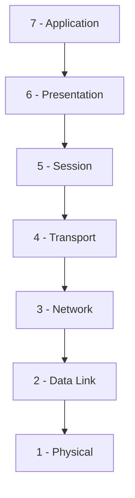
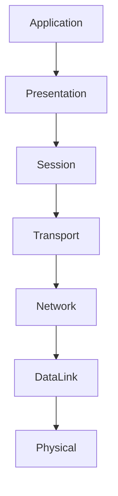
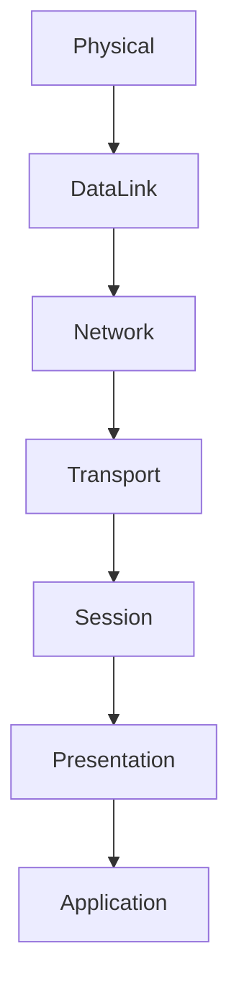
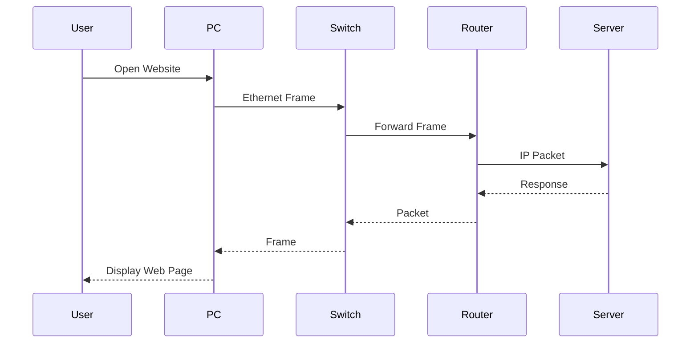

> [!info]
> The **Open Systems Interconnection (OSI) Model** is a conceptual framework that standardizes how data is transmitted between networked devices. It divides network communication into **seven distinct layers**, each responsible for specific networking functions.

---

## Table of Contents

- Overview
- Purpose
- History
- Why the OSI Model Matters
- The Seven Layers
- Layer Summary Table
- Encapsulation & Decapsulation
- Data Flow
- Communication Example
- Devices by Layer
- Common Protocols
- Troubleshooting by Layer
- Mnemonics
- OSI vs TCP/IP
- Advantages
- Limitations
- Key Takeaways
- Related Notes
- References

---

# Overview

The **OSI Model** provides a standardized way to understand how computers communicate across a network. Rather than treating communication as one complex process, it breaks it into **seven logical layers**, where each layer performs a specific role and communicates only with the layers directly above and below it.

Although modern networks primarily use the **TCP/IP protocol suite**, the OSI Model remains one of the most valuable tools for learning networking, designing systems, and troubleshooting connectivity problems.

---

# Purpose

The OSI Model was created to:

- Standardize communication between different vendors.
- Separate networking functions into manageable layers.
- Simplify troubleshooting.
- Encourage modular protocol design.
- Improve interoperability.

---

# History

The OSI Model was developed by the **International Organization for Standardization (ISO)** in the late 1970s and officially published in **1984**.

Its goal was to establish a universal networking framework that would allow computers from different manufacturers to communicate effectively.

Although the TCP/IP model eventually became the dominant implementation for the Internet, the OSI Model remains the industry-standard conceptual model for teaching and understanding networking.

---

# Why the OSI Model Matters

- Simplifies complex networking concepts.
- Helps isolate network problems.
- Provides a common language for engineers.
- Encourages modular network design.
- Makes protocol comparison easier.

> [!tip]
> When troubleshooting, always identify **which OSI layer** the issue belongs to before attempting a solution.

---

# The Seven Layers

---

## Layer 7 — Application

### Purpose

Provides network services directly to user applications.

### Responsibilities

- User interaction
- File transfer
- Email
- Web browsing
- Name resolution

### Common Protocols

- HTTP
- HTTPS
- FTP
- SMTP
- POP3
- IMAP
- DNS
- DHCP
- SNMP

### Devices

- Proxy servers
- Application gateways

### PDU

**Data**

### Real-world Analogy

Talking to a customer service representative.

---

## Layer 6 — Presentation

### Purpose

Ensures data is readable between systems.

### Responsibilities

- Encryption
- Compression
- Character encoding
- Data formatting

### Examples

- TLS
- SSL
- JPEG
- PNG
- ASCII
- Unicode

### PDU

**Data**

### Analogy

Translating one language into another.

---

## Layer 5 — Session

### Purpose

Creates, maintains, and terminates communication sessions.

### Responsibilities

- Authentication
- Session management
- Checkpoint recovery

### Examples

- NetBIOS
- RPC
- SMB Sessions

### PDU

**Data**

### Analogy

Starting and ending a phone call.

---

## Layer 4 — Transport

### Purpose

Provides end-to-end communication.

### Responsibilities

- Segmentation
- Reliability
- Flow control
- Error recovery
- Port numbers

### Protocols

- TCP
- UDP

### Devices

- Firewalls
- Layer 4 Load Balancers

### Addressing

**Port Numbers**

### PDU

**Segment (TCP)**

**Datagram (UDP)**

### Analogy

A courier delivering packages safely.

---

## Layer 3 — Network

### Purpose

Moves packets between different networks.

### Responsibilities

- Routing
- Logical addressing
- Path selection

### Protocols

- IPv4
- IPv6
- ICMP
- OSPF
- RIP
- BGP

### Devices

- Routers
- Layer 3 Switches

### Addressing

**IP Address**

### PDU

**Packet**

### Analogy

GPS selecting the best driving route.

---

## Layer 2 — Data Link

### Purpose

Transfers frames between devices on the same network.

### Responsibilities

- Framing
- MAC addressing
- Error detection
- VLAN tagging
- Switching

### Protocols

- Ethernet
- PPP
- STP
- 802.1Q

### Devices

- Switches
- Bridges

### Addressing

**MAC Address**

### PDU

**Frame**

### Analogy

Delivering mail within one neighborhood.

---

## Layer 1 — Physical

### Purpose

Transmits raw bits over physical media.

### Responsibilities

- Electrical signals
- Fiber optics
- Radio waves
- Connectors
- Cabling

### Devices

- Hubs
- Repeaters
- Cables
- NIC Physical Interface

### Addressing

None

### PDU

**Bits**

### Analogy

Roads connecting cities.

---

# Layer Summary

| Layer | Name         | PDU     | Address | Device   |
| ----- | ------------ | ------- | ------- | -------- |
| 7     | Application  | Data    | —       | Proxy    |
| 6     | Presentation | Data    | —       | Gateway  |
| 5     | Session      | Data    | —       | Gateway  |
| 4     | Transport    | Segment | Port    | Firewall |
| 3     | Network      | Packet  | IP      | Router   |
| 2     | Data Link    | Frame   | MAC     | Switch   |
| 1     | Physical     | Bits    | —       | Hub      |

---

# Encapsulation & Decapsulation

## Encapsulation

As data moves **down** the OSI Model, each layer adds its own header.

---

## Decapsulation

At the receiving host, headers are removed in reverse order.

---

# Data Flow Example

A user opens a web browser:

1. Browser creates HTTP request.
2. TCP adds transport information.
3. IP adds logical addressing.
4. Ethernet adds MAC addresses.
5. Bits travel across the medium.
6. Receiving device removes headers layer by layer.
7. Browser displays the webpage.

---

# Communication Example

---

# Devices by Layer

| Layer | Devices              |
| ----- | -------------------- |
| 7     | Proxy Server         |
| 6     | SSL Gateway          |
| 5     | Session Gateway      |
| 4     | Firewall             |
| 3     | Router               |
| 2     | Switch               |
| 1     | Hub, Repeater, Cable |

---

# Common Protocols

| Layer | Examples                        |
| ----- | ------------------------------- |
| 7     | HTTP, HTTPS, DNS, DHCP          |
| 6     | TLS, SSL                        |
| 5     | NetBIOS, RPC                    |
| 4     | TCP, UDP                        |
| 3     | IPv4, IPv6, ICMP                |
| 2     | Ethernet, PPP, STP              |
| 1     | Fiber, Copper, Wireless Signals |

---

# Troubleshooting by Layer

| Layer | Common Issues              |
| ----- | -------------------------- |
| 7     | DNS failure, HTTP errors   |
| 6     | TLS certificate errors     |
| 5     | Session timeout            |
| 4     | Port blocked, TCP reset    |
| 3     | Wrong IP, routing issues   |
| 2     | VLAN mismatch, MAC issues  |
| 1     | Cable unplugged, bad fiber |

> [!warning]
> Always troubleshoot from **Layer 1 upward** unless you have evidence pointing to a higher layer.

---

# Mnemonics

Top → Bottom

> **All People Seem To Need Data Processing**

Application

Presentation

Session

Transport

Network

Data Link

Physical

---

Bottom → Top

> **Please Do Not Throw Sausage Pizza Away**

Physical

Data Link

Network

Transport

Session

Presentation

Application

---

# OSI vs TCP/IP

| OSI               | TCP/IP                   |
| ----------------- | ------------------------ |
| 7 Layers          | 4 Layers                 |
| Conceptual Model  | Practical Protocol Suite |
| ISO Standard      | Internet Standard        |
| Used for Learning | Used on Real Networks    |

| TCP/IP Layer   | OSI Equivalent |
| -------------- | -------------- |
| Application    | Layers 5–7     |
| Transport      | Layer 4        |
| Internet       | Layer 3        |
| Network Access | Layers 1–2     |

---

# Advantages

- Standardized framework
- Easier troubleshooting
- Modular architecture
- Vendor interoperability
- Better understanding of protocols

---

# Limitations

- Mostly conceptual
- Rarely implemented exactly as defined
- Some protocols span multiple layers
- More complex than TCP/IP

---

# Key Takeaways

> [!note]
>
> - The OSI Model contains **7 layers**.
> - Each layer performs a specific networking function.
> - Data is **encapsulated** before transmission.
> - Data is **decapsulated** at the destination.
> - Each layer has its own protocols and devices.
> - The model is primarily used for learning, design, and troubleshooting.

---

# Related Notes

## Fundamentals

- [[TCP/IP Model]]
- [[Ethernet]]
- [[Frames, Packets & Segments]]
- [[Encapsulation]]
- [[Network Devices]]

## IP Addressing

- [[IPv4]]
- [[IPv6]]

## Routing

- [[Routing]]
- [[OSPF]]
- [[BGP]]

## Switching

- [[Switching]]
- [[VLAN]]
- [[STP]]

## Network Services

- [[ARP]]
- [[ICMP]]
- [[DHCP]]
- [[DNS]]

---
